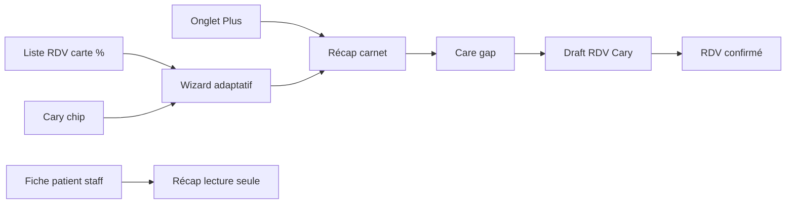

# Mon carnet de santé — Plan complet

**Prérequis :** [`cary_v2_ia_phase4_avance.plan.md`](cary_v2_ia_phase4_avance.plan.md) en prod (santé connectée, tendances, Cary hub).

**Différenciation :** moteur de **préparation de soins** et de **conversion RDV** — pas un formulaire médical statique. Jamais de diagnostic automatique.

**KPI north star :** `care_gap_actions.converted_to_appointment` / `care_gap_actions.shown`.

---

## Vision (une phrase)

Le patient complète en 2 minutes ce qui manque ; la **carte %** disparaît à 100 % ; Cary et les **Care Gaps** transforment les trous en **RDV pré-remplis** ; les soignants voient un **récap unifié** en lecture seule.

---

## Les 3 couches (ne pas confondre)

| Couche | Existant | Rôle |
|--------|----------|------|
| **Administratif** | Profil, documents Vitale/ordonnance | Identité, couverture |
| **Connectée** | `health_metrics`, onglet Mes données santé | Objectif (montre, balance) |
| **Déclarative** | **Nouveau carnet** | Antécédents, allergies, habitudes |

Le carnet enrichit la sync (pré-remplissage poids) et alimente Cary (`health_record_summary` dans [`MemoryComposer`](backend/lib/ai/MemoryComposer.php)).

---

## Parcours



---

## 1. Migrations (088–091)

| # | Fichier | Contenu |
|---|---------|---------|
| 088 | `088_health_record_schema.sql` | `health_record_schema` (version, sections_json) |
| 089 | `089_health_record_answers.sql` | `health_record_answers` (patient_id, question_key, value_json, source) |
| 090 | `090_health_record_meta.sql` | `health_record_completion`, `health_record_access_log`, `care_gaps` |
| 091 | `091_health_record_nudges.sql` | `health_record_nudges`, `care_gap_actions` |

Scripts : `database/scripts/apply-migration-088-090-carnet.sh`, `apply-migration-091-carnet-nudges.sh`

---

## 2. Schéma questionnaire v1

Fichier : `backend/config/health-record-schema-v1.json`

| Section | Clés exemple | Type |
|---------|--------------|------|
| `general` | `height_cm`, `weight_declared_kg` | number / unknown |
| `cardio` | `cholesterol_known`, `hypertension`, `heart_event_history` | yes_no_unknown |
| `metabolic` | `diabetes`, `thyroid_disorder` | yes_no_unknown |
| `allergies` | `drug_allergies`, `food_allergies`, `latex_allergy` | text / yes_no |
| `treatments` | `current_medications` | text optional |
| `lifestyle` | `smoking`, `alcohol`, `activity_level` | enum |
| `surgical` | `hospitalizations`, `surgeries` | text optional |
| `family` | `family_cardio_history` | yes_no_unknown |
| `gynecology` | `pregnancy_status` | conditional (genre femme) |

**Pondération complétion :** profil 15 % · antécédents+cardio+métabo 45 % · allergies+traitements 20 % · sync santé 10 % · documents clés 10 %. `unknown` = 50 % du poids question.

---

## 3. Backend

| Service | Fichier | Rôle |
|---------|---------|------|
| `HealthRecordService` | `backend/lib/health/HealthRecordService.php` | CRUD, récap, export |
| `CompletionEngine` | `backend/lib/health/CompletionEngine.php` | % + `missing_sections[]` |
| `CareGapEngine` | `backend/lib/health/CareGapEngine.php` | Détection écarts |
| `CareGapActionService` | `backend/lib/health/CareGapActionService.php` | Actions → draft RDV |
| `HealthRecordNudgeService` | `backend/lib/health/HealthRecordNudgeService.php` | Push avec cooldown |

### API

| Route | Rôle |
|-------|------|
| `GET /health-record/completion` | Patient — % + sections manquantes |
| `GET /health-record/recap` | Patient — récap complet |
| `PATCH /health-record/answers` | Batch upsert réponses |
| `GET /health-record/schema` | Schéma actif UI |
| `GET /health-record/export` | Export RGPD JSON |
| `GET /patients/{id}/health-record` | Staff — ACL + access log auto |

### Care Gaps (règles v1)

| `gap_key` | Condition | Action |
|-----------|-----------|--------|
| `lipid_panel_unknown` | cholestérol inconnu + âge ≥ 40 | `book_blood_test` |
| `carnet_incomplete_pre_rdv` | < 70 % + RDV < 48 h | `complete_carnet` |
| `health_sync_stale` | pas de sync 14 j | `reconnect_health` |
| `smoking_no_followup` | tabac oui + pas RDV prévention 12 mois | `book_prevention` |
| `book_followup_lab` | résultat labo RAG + pas RDV | draft suivi |

Intégration : [`AiBookingService`](backend/lib/ai/AiBookingService.php), [`PatientDossierAccess`](backend/lib/PatientDossierAccess.php), patterns [`/health/*`](backend/api/health/).

---

## 4. Mobile patient

```
apps/mobile/src/features/health-record/
  api/health-record.service.ts
  hooks/use-health-record-completion.ts
  hooks/use-health-record-wizard.ts
  components/HealthRecordProgressRing.tsx
  components/HealthRecordPromptCard.tsx
  components/HealthRecordQuestionStep.tsx
  components/HealthRecordSectionRecap.tsx
  components/HealthRecordGapActionCard.tsx
  screens/HealthRecordWizardScreen.tsx
  screens/HealthRecordRecapScreen.tsx
```

Routes : `/(patient)/health-record`, `/(patient)/health-record/wizard?section=cardio`

### Carte liste RDV

[`PatientAppointmentsListScreen`](apps/mobile/src/features/patient/screens/PatientAppointmentsListScreen.tsx) — `ListHeader` après filtres, avant « Réserver » :

- Cercle SVG gradient teal + % + ♥ « Mon carnet de santé »
- Sous-texte : « 3 questions — 2 min »
- **Masquée si ≥ 100 %**
- Tap → wizard (questions manquantes uniquement)

### Wizard adaptatif

- 1 question / écran — Oui / Non / Je ne sais pas
- Follow-up si Oui · auto-save PATCH · barre progression section
- Référence UX : [`BookingWizardScreen`](apps/mobile/src/features/appointments/form/screens/BookingWizardScreen.tsx)

### Récap

En-tête % · sections éditables · données connectées 7j · tendances `/ai/trends` · cartes Care Gap avec CTA « Réserver »

### Entrées navigation

| Emplacement | Fichier |
|-------------|---------|
| Liste RDV | Carte si < 100 % |
| Plus | [`more.tsx`](apps/mobile/app/(patient)/(tabs)/more.tsx) — ♥ + badge % |
| Profil | [`ProfileHubScreen`](apps/mobile/src/features/profile/screens/ProfileHubScreen.tsx) |
| Santé connectée | [`HealthDataScreen`](apps/mobile/src/features/health-sync/screens/HealthDataScreen.tsx) — lien secondaire |

---

## 5. Cary & moteur RDV

**MemoryComposer** — snapshot `health_record_summary` (allergies, conditions, gaps, completion %).

Chips : « Compléter mon carnet », « Réserver un bilan », « Préparer mon RDV de demain ».

Task routing : `health_record_coach` (Grok léger, pas de diagnostic).

**Cron :** `backend/cron/health-record-rdv-nudges.php` (07:00 Paris) — push pré-RDV, gap lipidique, sync stale. Cooldown anti-spam via `health_record_nudges`.

**Analytics :** `health_record_gap_shown` → `clicked` → `converted` (appointment_id).

---

## 6. Staff (mobile + web)

[`PatientDetailScreen`](apps/mobile/src/features/patients/screens/PatientDetailScreen.tsx) — ligne **Carnet de santé** → `StaffHealthRecordScreen` :

- Bandeau : *Données déclarées par le patient — à confirmer en consultation*
- Récap déclaratif + sync 7j + tendances + gaps ouverts
- **Lecture seule** v1 · log `health_record_access_log`

Web : `PatientHealthRecordPanel.vue` dans fiche patient dashboard — même API staff.

Rôles : nurse, pro, lab, sub, préleveur (si ACL dossier existante).

---

## 7. Garde-fous & conformité

- Schéma versionné validé référent médical — LLM ne génère pas les questions
- Disclaimer permanent · consentement données santé
- Export RGPD · audit accès staff
- Jamais : « vous êtes malade » — uniquement « information manquante » ou « suivi suggéré »

---

## 8. Déploiement

```bash
./database/scripts/apply-migration-088-090-carnet.sh --remote-only
./database/scripts/apply-migration-091-carnet-nudges.sh --remote-only
./buildlocaloneandlab.sh
# cron : backend/cron/setup-server-cron.sh
# mobile : build EAS
```

Tests : `backend/tests/health/HealthRecordAclTest.php`, `CompletionEngineTest.php`

---

## Definition of done

- [ ] Carte RDV → wizard → récap ; carte absente à 100 %
- [ ] 3+ Care Gaps avec CTA RDV mesurable
- [ ] Cary reçoit `health_record_summary`
- [ ] Staff mobile + web — lecture seule + audit
- [ ] Export RGPD · push nudges · prod déployée
