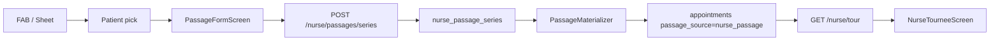

# Nouveau système Passage infirmier — Rapport & Plan

**Date audit :** 2 juillet 2026
**Périmètre :** rôle `nurse`, RDV `nursing`, `assigned_nurse_id` = infirmier connecté.

---

## 1. Rapport d'état — ta spec vs ce qui existe

### 1.1 Verdict global

| Zone | Couverture | Commentaire |
|------|------------|-------------|
| **Backend + DB** | ~95 % | Modèle complet, matérialisation robuste, API CRUD |
| **Mobile (cœur produit)** | ~85 % | Parcours principal livré ; gaps UX terrain |
| **Shared types** | 100 % | Aligné backend/mobile |
| **Frontend web** | ~25 % | FAB + form basique ; pas de dual-tab ni détail |

**Conclusion :** le socle technique est **déjà en place**. Ce qui manque surtout, c'est du **polish UX** (calendriers, jours semaine, soins type booking) et la **parité web**.

---

### 1.2 Architecture actuelle

Un passage matérialisé = un RDV `nursing` dans `appointments` + stop `nurse_tour_stops`.
La récurrence = table `nurse_passage_series` qui **génère** les RDV via `PassageMaterializer`.



---

### 1.3 Spec produit — point par point

| # | Ta demande | État | Détail / gap |
|---|------------|------|--------------|
| 1 | Onglet **Passage intelligent** au-dessus nav jours | ✅ | `TourViewTabs` au-dessus de `TourDayStrip` dans `NurseTourneeScreen.tsx` |
| 2 | Onglet **Passage** séparé (liste manuelle type Ozen) | ⚠️ | Existe sous le nom **« Mes passages »** — à renommer en **« Passage »** |
| 3 | Nav jours partagée entre les deux onglets | ✅ | `TourDayStrip` commun, même `?date=` |
| 4 | FAB bas-droite « Ajouter un passage » | ✅ | `PassageFab.tsx`, visible uniquement onglet manuel |
| 5 | Sheet : jour J vs chronique/autre jour | ✅ | `PassagePlanningSheet.tsx` |
| 6 | Liste patients réutilisable + créer patient | ✅ | `PassagePatientPickScreen` + `CreatePatientModal` |
| 7 | Détail « Prise en charge » : nom, créneau, domicile, durée | ✅ | `PassageFormScreen` — titre « Prise en charge » |
| 8 | Créneaux Matin → Nuit + personnalisée | ⚠️ | 6 créneaux OK ; heure perso = **TextInput HH:MM**, pas time picker |
| 9 | Toggle à domicile (défaut ON) | ✅ | `ToggleSwitch`, défaut `true` |
| 10 | Durée 15 / 30 / 60 / perso | ✅ | Presets + input minutes |
| 11 | Planification : intervalle (défaut 3j) | ✅ | Backend + form ; `every_days` modifiable |
| 12 | Planification : jours semaine (lun+ven ex.) | ⚠️ | Backend OK ; UI = **Lundi + Jeudi seulement** hardcodés |
| 13 | Planification : dates custom (mini calendrier) | ⚠️ | Backend OK ; UI = **saisie texte** `2026-09-14, …` |
| 14 | Planification : aucune (manuel) | ⚠️ | Backend + type OK ; **1 RDV à start_date** ; pas d'UI materialize |
| 15 | Dates début / fin (fin optionnelle) | ⚠️ | Fin OK en texte ; **date début = jour du strip**, non modifiable dans le form |
| 16 | Section soins vide + Ajouter | ⚠️ | Liste checkbox plate ; pas bouton « Ajouter » → picker |
| 17 | Soins infirmier only (comme booking) | ⚠️ | `fetchCategories('nursing')` OK ; **pas** `CareSelectionStep` ni `care_options` |
| 18 | Multi-soins même patient | ✅ | `nursing_items[]` + `creation_batch_id` |
| 19 | Liste jour : prénom nom, soins, horaire | ✅ | `PassageSimpleListRow` |
| 20 | Cercle check → vert quand fait | ✅ | Toggle `visit_status = done` |
| 21 | Récurrence visible N jours (ex. 7j) | ✅ | `PassageDateExpander` ; cap 90j sans fin |
| 22 | Tap nom → détail passage | ✅ | Route `/(nurse)/passage/[seriesId]` |
| 23 | Payload RDV infirmier adapté | ✅ | `PassageMaterializer.php` — `form_data`, `passage_source`, etc. |
| 24 | Web identique | ❌ | Form minimal, pas onglets, pas liste Ozen, pas détail |

---

### 1.4 Ce qui fonctionne (fichiers clés)

#### Mobile

| Composant | Fichier |
|-----------|---------|
| Écran tournée + onglets | `apps/mobile/src/features/tournee-nurse/screens/NurseTourneeScreen.tsx` |
| Onglets intelligent / manuel | `apps/mobile/src/features/nurse-passage/components/TourViewTabs.tsx` |
| FAB + sheet planification | `PassageFab.tsx`, `PassagePlanningSheet.tsx` |
| Patient pick | `PassagePatientPickScreen.tsx` |
| Formulaire création | `PassageFormScreen.tsx` |
| Liste simple | `PassageSimpleListRow.tsx` |
| Détail / édition | `PassageDetailScreen.tsx` |
| Routes Expo | `apps/mobile/app/(nurse)/passage/new.tsx`, `[seriesId].tsx`, `patient-pick.tsx` |

#### Backend

| Service | Fichier |
|---------|---------|
| CRUD série | `backend/lib/nurse-passage/NursePassageSeriesService.php` |
| Génération RDV | `backend/lib/nurse-passage/PassageMaterializer.php` |
| Expansion dates | `backend/lib/nurse-passage/PassageDateExpander.php` |
| Créneau → scheduled_at | `backend/lib/nurse-passage/PassageSlotResolver.php` |
| API | `backend/api/nurse/passages/series/` (POST, GET, PATCH, DELETE, materialize) |

#### Données

| Artefact | Fichier |
|----------|---------|
| Migration | `database/migrations/093_nurse_passage_series.sql` |
| Types TS | `packages/shared-types/src/nurse-passage.ts` |
| Intégration tournée | `NurseTourService.php` expose `passage_series_id`, `passage_time_slot`, `passage_duration_minutes` |

#### Payload RDV généré (extrait)

```json
{
  "type": "nursing",
  "status": "confirmed",
  "assigned_nurse_id": "<nurse>",
  "passage_series_id": "<uuid>",
  "passage_source": "nurse_passage",
  "form_data": {
    "passage_time_slot": "morning",
    "passage_duration_minutes": 30,
    "at_home": true,
    "passage_source": "nurse_passage",
    "nursing_items": [{ "category_id": "...", "care_options": {} }]
  }
}
```

---

### 1.5 Gaps prioritaires (par impact terrain)

#### P0 — UX formulaire (mobile)

1. **Renommer** « Mes passages » → **« Passage »**
2. **Date de début** modifiable (mode chronique) — date picker, pas seulement le jour du strip
3. **7 jours de la semaine** — chips Lun…Dim au lieu de Lundi/Jeudi
4. **Mini-calendrier** multi-sélection pour `custom_dates`
5. **Time picker natif** pour heure personnalisée
6. **Soins type booking** — bouton « Ajouter un soin » → sheet avec catalogue nursing + options (`CareCategoryFilterBar` / `CareSelectionStep` en mode compact)

#### P1 — Détail & mode manuel

7. **Édition soins** depuis `PassageDetailScreen` (PATCH `nursing_items`)
8. **Mode manual** — action « Planifier ce jour » → `POST .../materialize` ou création unitaire
9. **Date pickers** pour début/fin dans le détail (remplacer inputs texte)

#### P2 — Qualité & web

10. **Tests PHPUnit** — `PassageMaterializer`, ACL, idempotence (seul `PassageDateExpanderTest.php` existe)
11. **Parité web** — dual-tab sur `/nurse/tournee`, liste simple, détail série, création patient

---

## 2. Architecture écran cible (validée)

```
┌─────────────────────────────────────────┐
│  [ Passage intelligent ] [ Passage ]    │  ← TourViewTabs
├─────────────────────────────────────────┤
│  ←  hier · Aujourd'hui · Demain  →      │  ← TourDayStrip (commun)
├─────────────────────────────────────────┤
│  ONGLET INTELLIGENT :                    │
│    chips ordre · hero prochain stop      │
│    TourStopCard (carte complète)         │
├─────────────────────────────────────────┤
│  ONGLET PASSAGE :                        │
│    PassageSimpleListRow (liste épurée)   │
│                              [FAB +]     │
└─────────────────────────────────────────┘
```

---

## 3. Parcours FAB (implémenté)

| Choix sheet | `planning_type` | Comportement |
|-------------|-----------------|--------------|
| Passage uniquement ce jour | `single_day` | 1 RDV à la date du strip |
| Passage chronique ou autre jour | (form) | Section planification complète |

**Gap restant :** en mode chronique, permettre de choisir une **date de début différente** du jour affiché sur le strip.

---

## 4. Formulaire — spec vs implémentation

### 4.1 Créneaux (`passage_time_slot`)

| Slot | Label | Heure Paris | Statut |
|------|-------|-------------|--------|
| morning | Matin | 08:00 | ✅ |
| noon | Midi | 12:00 | ✅ |
| afternoon | Après-midi | 15:00 | ✅ |
| evening | Soir | 18:00 | ✅ |
| night | Nuit | 21:00 | ✅ |
| custom | Personnalisée | saisie | ⚠️ TextInput |

### 4.2 Planification

| Option | Backend | Mobile form | Gap |
|--------|---------|-------------|-----|
| Intervalle (défaut 3j) | ✅ | ✅ | Date début = strip only |
| Jours semaine | ✅ | ⚠️ | 2 jours seulement |
| Dates custom | ✅ | ⚠️ | Texte, pas calendrier |
| Aucune (manual) | ✅ | ✅ | Pas UI materialize |
| Date fin optionnelle | ✅ | ⚠️ | Input texte AAAA-MM-JJ |
| Cap 90j sans fin | ✅ | — | OK |

### 4.3 Soins

**Spec :** section vide → « Ajouter » → picker soins infirmier (même catalogue que demande RDV, filtré nursing).

**Actuel :** liste checkbox de toutes les catégories nursing sur le form.

**À faire :** flow « Ajouter un soin » + réutiliser composants wizard booking + support `care_options`.

---

## 5. Liste « Passage » — implémentée

```
┌─────────────────────────────────────────────────────┐
│ Jean Dupont                              ( ○/✓ )    │
│ Pansement · Prise de sang                           │
│ Matin · 30 min                                      │
└─────────────────────────────────────────────────────┘
```

- Tap nom → `PassageDetailScreen`
- Cercle → toggle fait (vert + check)
- Tri par créneau (`sort-manual-stops.ts`)
- Bonus livré : bouton « Je pars » + reorder haut/bas

---

## 6. Modèle de données — livré (migration 093)

### Table `nurse_passage_series`

| Colonne | Rôle |
|---------|------|
| planning_type | single_day \| interval \| weekdays \| custom_dates \| manual |
| planning_config | JSON (every_days, weekdays, dates, start/end) |
| time_slot, custom_time, duration_minutes, at_home | Créneau & durée |
| nursing_items | JSON [{ category_id, care_options? }] |

### Extension `appointments`

- `passage_series_id`, `passage_source` (nurse_passage \| booking \| staff_wizard)

---

## 7. API — livrée

| Route | Statut |
|-------|--------|
| POST `/nurse/passages/series` | ✅ |
| GET/PATCH/DELETE `/nurse/passages/series/{id}` | ✅ |
| POST `/nurse/passages/series/{id}/materialize` | ✅ (non branché UI manual) |
| GET `/nurse/tour?date=` | ✅ (inchangé, inclut passages) |

---

## 8. Phasage restant

| Phase | Contenu | Priorité |
|-------|---------|----------|
| **A — Polish mobile** | Renommer onglet, date début, 7 jours, date pickers, time picker, soins wizard | P0 |
| **B — Détail & manual** | Edit soins, materialize UI, custom time/durée en édition | P1 |
| **C — Tests** | PHPUnit materializer + ACL | P1 |
| **D — Web** | Dual-tab, liste Ozen, form complet, détail | P2 |

---

## 9. Definition of done (spec complète)

- [x] Deux onglets au-dessus du strip jours
- [ ] Onglet manuel nommé **« Passage »** (pas « Mes passages »)
- [x] FAB + choix jour J vs chronique
- [x] Liste patients + création patient
- [x] Formulaire : créneaux, domicile, durée, 4 modes planification (v1)
- [ ] Date début modifiable + calendrier custom + 7 jours semaine
- [ ] Soins : flow « Ajouter » type booking + care_options
- [x] Génération RDV sur les bons jours
- [x] Liste simple : nom, soins, horaire, cercle check
- [x] Tap nom → détail ; check → fait synchronisé
- [x] Passage intelligent : ordre optimisé inchangé
- [ ] PHPUnit materializer + ACL
- [ ] Parité web

---

## 10. Références

| Sujet | Chemin |
|-------|--------|
| Plan tournée v1 | `.cursor/plans/nurse_tournee.plan.md` |
| Wizard RDV nurse | `apps/mobile/app/(nurse)/appointments/new.tsx` |
| CareSelectionStep | `apps/mobile/src/features/appointments/form/...` |
| Liste patients staff | `apps/mobile/src/features/patients/screens/PatientsListScreen.tsx` |

---

## 11. Synthèse pour validation

**Tu as déjà ~85 % du mobile et ~95 % du backend.** Le parcours principal fonctionne :

1. Onglet **Passage intelligent** = tournée optimisée existante.
2. Onglet **Mes passages** (= futur « Passage ») = liste Ozen + FAB.
3. Création rapide avec récurrence matérialisée en RDV.

**Prochaine étape recommandée :** Phase A (polish UX) — renommer l'onglet, date pickers, 7 jours semaine, soins type booking. C'est ce qui rapproche le plus l'expérience de ta spec terrain.
