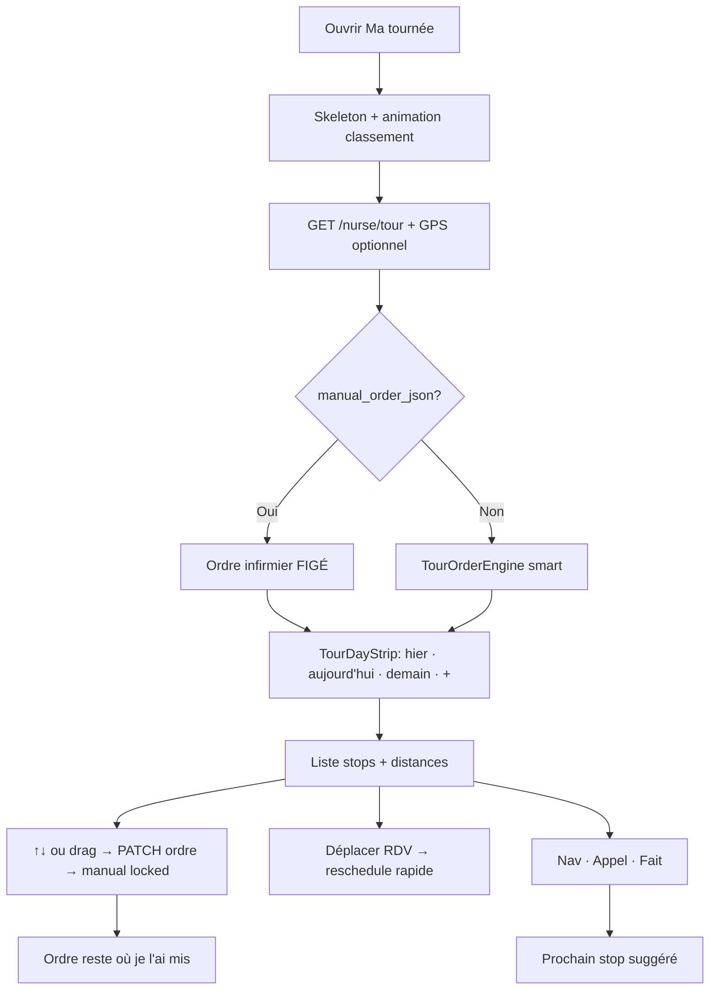

# Ma tournée infirmier — Plan complet

**Prérequis :** segment infirmier `nurse_segment=acceptes` opérationnel · RDV `nursing` avec `assigned_nurse_id`.

**Hors périmètre :** carnet de santé patient, dossier médical enrichi, IA patient — **aucune dépendance** au plan carnet. La tournée ne lit que les données RDV déjà présentes (patient, adresse, créneau, soin, téléphone).

**Périmètre strict :** rôle **`nurse`**, type **`nursing`**, `assigned_nurse_id` — **pas** la tournée préleveur (`blood_test`, `TourneeScreen` préleveur).

**Objectif produit :** **gagner du temps** à l’infirmier chaque matin et à chaque passage — moins de taps, moins de km, moins d’allers-retours entre apps.

**KPI north star :**
- temps médian « ouvrir tournée → lancer navigation vers 1er stop » < **3 s**
- `(stops « fait » avant fin créneau) / stops planifiés`
- **km estimés** jour — objectif **−15 %** vs ordre créneau seul

**Principe géoloc v1 :** gratuit — Haversine + `expo-location` ponctuelle · navigation via Waze/Maps (deep links).

---

## Vision (une phrase)

L’infirmier ouvre **Ma tournée**, voit **aujourd’hui ou demain** comme un mini-calendrier, Cary propose l’ordre optimal pendant une **animation de chargement**, il **déplace un RDV** ou **réordonne** en un geste — et **son ordre reste figé** — puis navigue et marque **fait** sans friction.

---

## Ce qui existe déjà (à réutiliser)

| Existant | Fichier | Réutilisation |
|----------|---------|---------------|
| Filtre RDV acceptés infirmier | `backend/api/appointments/index.php` (`nurse_segment=acceptes`) | Source stops par jour |
| Waze depuis détail RDV | [`open-waze.ts`](apps/mobile/src/features/appointments/detail/utils/open-waze.ts) | Navigation partagée |
| Coords / adresse RDV | `resolveAppointmentMapCoords`, `appointmentAddressLine` | Distance + carte |
| Calendrier infirmier web | `frontend/pages/nurse/calendar/` | Pattern navigation jours |
| Liste mobile infirmier | [`NurseAppointmentsListScreen`](apps/mobile/src/features/nurse/screens/NurseAppointmentsListScreen.tsx) | Bandeau « Ma tournée » |
| Carte Leaflet web | `CoverageMapLive` | Markers tournée |
| Reprise / modification RDV | flows existants staff | Base pour **déplacer créneau** depuis stop |

---

## Parcours



---

## Règle d’or — ordre manuel figé

| Situation | Comportement |
|-----------|--------------|
| Infirmier déplace un stop (↑↓, drag web, long-press « Monter ») | `sort_mode = manual` · `manual_order_locked = true` · `appointment_order_json` persisté |
| Réouverture app / lendemain même jour | **Même ordre** — le moteur smart **ne réécrit jamais** tant que `manual_order_locked` |
| Tap « Optimiser » ou chip « Intelligent » | Dialog : *« Remplacer votre ordre ? »* — uniquement si confirmé |
| Tap « Réinitialiser l’ordre » | Efface lock → recalcul smart |
| Changement de **jour** (strip calendrier) | Plan séparé par `tour_date` — ordre manuel **par jour** |

**Tests obligatoires :** déplacer stop 3 en position 1 → kill app → rouvrir → stop toujours en 1.

---

## Navigation calendrier — aujourd’hui · demain · J+N

### Mobile `TourDayStrip`

- Bandeau horizontal sous le header : **← hier · Aujourd’hui · Demain · ven. 27 →**
- Dot sur les jours avec ≥1 RDV accepté
- Swipe horizontal change `?date=` · prefetch jour adjacent
- Comportement type **agenda compact** (pas le calendrier mensuel complet)

### Web

- Même strip + lien « Voir calendrier complet » vers `/nurse/calendar`

### API

- `GET /nurse/tour?date=YYYY-MM-DD` — un plan par jour
- `GET /nurse/tour/summary?from=&to=` — compteurs RDV par jour (dots strip, 1 requête semaine)

---

## Déplacer un RDV (créneau) depuis la tournée

**Besoin terrain :** l’infirmier anticipe un retard et veut **décaler un passage** sans quitter la tournée.

| Action | UX |
|--------|-----|
| Menu stop « Déplacer » | Bottom sheet : créneaux libres même jour (ou lendemain si vide) |
| Validation | `PATCH /appointments/{id}/reschedule` (endpoint existant ou wrapper nurse) |
| Après déplacement | Stop reste à **la même position dans l’ordre manuel** si lock actif · badge créneau mis à jour |
| Alerte créneau | Si nouveau créneau incompatible avec ordre voisin → toast warning, pas de blocage |

**Garde-fou :** pas de modification adresse patient depuis la tournée — uniquement **horaire / créneau**.

---

## Animation ouverture (UX moderne)

Pendant `GET /nurse/tour` + calcul ordre + GPS :

1. **Skeleton** header (date, stats, strip jours)
2. **3–5 cartes stop fantômes** (shimmer)
3. Texte discret : *« Organisation de votre tournée… »*
4. À la réponse : **stagger** apparition stops (Reanimated `FadeInDown`, 40 ms entre chaque)
5. Hero « Prochain stop » slide-in en dernier

**Pas de spinner plein écran** — l’écran est immédiatement « vivant ».

Durée cible animation : **400–800 ms** même si API plus lente (skeleton jusqu’à data).

---

## Géolocalisation gratuite — architecture v1

| Couche | Techno | Rôle |
|--------|--------|------|
| Position infirmier | `expo-location` When In Use | Point départ |
| Distance | Haversine `shared-utils` | Badge « 2,3 km » |
| Tri | nearest-neighbor + créneaux | Mode `smart` |
| Navigation | Waze / Maps deep links | Itinéraire réel |

**v2 backlog :** OSRM self-hosted si Haversine insuffisant.

---

## 1. Migration (092)

### `nurse_tour_plans`

| Colonne | Type | Rôle |
|---------|------|------|
| `id` | UUID | PK |
| `nurse_id` | UUID | Infirmier |
| `tour_date` | DATE | Jour Europe/Paris |
| `appointment_order_json` | JSON | `["apt_id", …]` ordre manuel |
| `manual_order_locked` | BOOLEAN | **true** dès 1er réordonnancement — smart ne touche plus |
| `nav_app_pref` | ENUM | `waze` \| `google_maps` \| `apple_maps` \| `system` |
| `sort_mode` | ENUM | `smart` \| `schedule` \| `nearest` \| `manual` |
| `optimized_at` | DATETIME | Dernier calcul auto |
| `updated_at` | DATETIME | |

Unique `(nurse_id, tour_date)`.

### `nurse_tour_stops`

| Colonne | Type | Rôle |
|---------|------|------|
| `visit_status` | ENUM | `todo` \| `en_route` \| `on_site` \| `done` \| `skipped` |
| `visited_at` | DATETIME | Passage réel |
| `skip_reason` | VARCHAR | Optionnel |

---

## 2. Backend

| Service | Rôle |
|---------|------|
| `NurseTourService` | RDV jour + plan + stops + distances |
| `TourOrderEngine` | Tri multi-modes — **respecte `manual_order_locked`** |
| `TourProximity` | Haversine · nearest-neighbor |
| `TourVisitService` | Statuts passage · sync RDV |

### Modes de tri

- **`smart`** (défaut si pas de lock) : créneaux + proximité + regroupement adresse
- **`schedule`** : créneau asc
- **`nearest`** : plus proche depuis position
- **`manual`** : `appointment_order_json` uniquement

### API

| Route | Rôle |
|-------|------|
| `GET /nurse/tour?date=` | Stops + summary + lock state |
| `GET /nurse/tour/summary?from=&to=` | Compteurs par jour (strip) |
| `PATCH /nurse/tour/order` | `{ date, appointment_ids[] }` → lock manual |
| `POST /nurse/tour/optimize` | Preview/apply — **refus si locked sans `force=true`** |
| `POST /nurse/tour/reset-order` | Efface lock + recalc smart |
| `POST /nurse/tour/stops/{id}/status` | Fait / en route / … |
| `GET /nurse/tour/calendar.ics?date=` | Export ICS |

---

## 3. Mobile — feature `tournee-nurse/`

```
components/
  TourDayStrip.tsx              # mini-calendrier horizontal
  TourLoadingSkeleton.tsx       # ouverture + shimmer
  TourNextStopHero.tsx
  TourStopCard.tsx              # patient, soin, créneau, km, ↑↓
  TourStopRescheduleSheet.tsx   # déplacer RDV
  TourSortModeChips.tsx
  TourMapPreview.tsx
screens/NurseTourneeScreen.tsx
```

### Ouverture

1. Skeleton + animation immédiate
2. GPS parallèle (non bloquant)
3. Liste stagger — **sans réordonner** si `manual_order_locked`

### Réordonnancement

- **↑ ↓** gants-friendly mobile · drag web
- Chaque move → debounce PATCH → `manual_order_locked = true`
- Toast discret : *« Ordre enregistré »*

---

## 4. Web — `/nurse/tournee`

- Strip jours · drag & drop · carte polyline · déplacer RDV · ICS
- Même règle ordre manuel figé

---

## 5. Intégrations (périmètre tournée uniquement)

| Système | Lien |
|---------|------|
| Statut RDV | `on_site` → `inProgress` · `done` → `completed` |
| Reprise RDV | Déplacer créneau depuis stop |
| Notifications | v2 : push patient « en route » |
| Analytics | `nurse_tour_opened`, `nurse_tour_reordered`, `nurse_tour_rescheduled`, `nurse_tour_nav_opened` |

---

## 6. Garde-fous

- Ordre tournée **invisible patient**
- Position infirmier **jamais stockée** en BDD
- Optimisation smart **jamais silencieuse** si ordre manuel actif
- Accessibilité : boutons larges · VoiceOver « Stop 3 sur 8 »

---

## Definition of done

- [ ] Strip calendrier : aujourd’hui · demain · navigation J+N avec prefetch
- [ ] Animation skeleton + stagger à l’ouverture
- [ ] Ordre manuel **persisté et jamais écrasé** sans confirmation
- [ ] Déplacer un RDV (créneau) depuis la carte stop
- [ ] Distances · modes tri · navigation 1-tap · fait/pas fait
- [ ] Web : drag & drop · strip jours · ICS
- [ ] PHPUnit : ordre sticky + lock + smart refuse overwrite
- [ ] Prod + EAS mobile

---

## Phasage

| Phase | Contenu | Durée |
|-------|---------|-------|
| **1** | Migration · API · ordre lock · mobile liste + skeleton + strip jours + ↑↓ | 1 sprint |
| **2** | GPS · distances · hero · navigation · déplacer RDV · fait/pas fait | 0,5 sprint |
| **3** | Web · ICS · analytics | 0,5 sprint |
| **4** | OSRM · notif patient en route | backlog |
