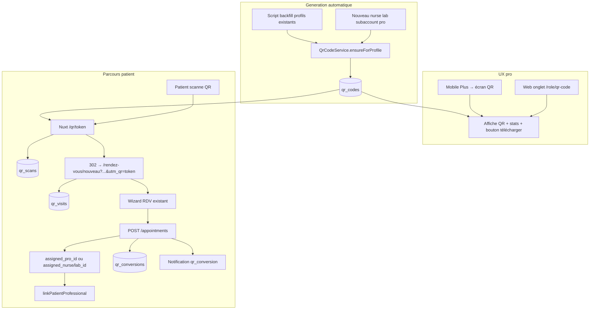
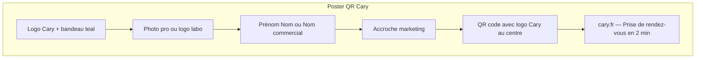

# Plan Cary V2 — QR code professionnel (autonome)

Plan dédié, **séparé du plan IA** ([`prompt_cary_v2_ia_66af59fd.plan.md`](d:/Clients/onev2/.cursor/plans/prompt_cary_v2_ia_66af59fd.plan.md)).

---

## 1. Objectif produit

Permettre à chaque **professionnel de santé Cary** d'avoir un QR code **généré automatiquement**, qui renvoie vers la **prise de rendez-vous**, avec suivi **flash (scans)** et **RDV pris**. Expérience **immédiate** : à l'ouverture de l'onglet web ou de l'écran mobile, le QR et les stats sont visibles sans action préalable.

---

## 2. Rôles éligibles

| Rôle | Plateforme | QR auto | Redirect cible |
|------|------------|---------|----------------|
| `nurse` | Web + mobile | Oui | `/rendez-vous/nouveau?provider_id={id}&provider_type=nurse&utm_qr={token}` |
| `lab` | Web | Oui | `provider_type=lab` |
| `subaccount` | Web | Oui | `provider_type=lab` (profil sous-compte = lab public) |
| `pro` | Web + mobile | Oui | `/rendez-vous/nouveau?provider_id={id}&provider_type=pro&utm_qr={token}` → **`assigned_pro_id`** |
| `preleveur` | — | **Non** | Pas de QR patient-facing en v1 |
| `patient` | — | Non | — |
| `super_admin` | Web admin | Lecture seule | Cockpit global (pas de QR personnel) |

**Règle redirect :** le QR renvoie **directement vers le lien rendez-vous**, pas vers la fiche publique `/infirmier/{slug}` (la fiche publique reste un canal parallèle existant).

---

## 3. Audit existant (~30 %)

| Déjà en place | À construire |
|---------------|--------------|
| Profils `public_slug` — migrations [019](d:/Clients/onev2/database/migrations/019_add_public_profile_fields.sql), [030](d:/Clients/onev2/database/migrations/030_public_profile_extra_fields.sql) | Tables `qr_*` |
| Booking vitrine `provider_id` + `provider_type` — [`PublicProfileLayout.vue`](d:/Clients/onev2/frontend/components/public/PublicProfileLayout.vue), [`rendez-vous/nouveau.vue`](d:/Clients/onev2/frontend/pages/rendez-vous/nouveau.vue) | Génération auto QR |
| Sidebar rôles — [`frontend/layouts/dashboard.vue`](d:/Clients/onev2/frontend/layouts/dashboard.vue) (l.773+) | **Onglet « QR code »** dédié |
| Mobile Plus — [`more.tsx` nurse](d:/Clients/onev2/apps/mobile/app/(nurse)/(tabs)/more.tsx), [pro](d:/Clients/onev2/apps/mobile/app/(pro)/(tabs)/more.tsx) | **Écran QR code** dédié |
| Admin nav — [`dashboard.vue`](d:/Clients/onev2/frontend/layouts/dashboard.vue) menu `super_admin` | **Onglet admin « QR code »** |

Dernière migration : **066** → QR en **067+**.

---

## 4. Workflow cible



**Métriques affichées au pro (web + mobile) :**
- **Flashes** = `qr_scans` (dédupliqués IP_hash / 1h)
- **Visites booking** = `qr_visits` (page RDV ouverte via QR)
- **RDV pris** = `qr_conversions`
- Taux conversion : RDV / flashes (période 7j / 30j / tout)

---

## 5. Schéma base de données (067+)

**`qr_codes`** (1 code par défaut par profil éligible)
- `id`, `profile_id` (FK UNIQUE), `user_role` ENUM(`nurse`,`lab`,`subaccount`,`pro`)
- `token` (VARCHAR UNIQUE, 8–12 chars alphanum)
- `redirect_url` (VARCHAR — URL complète cary.fr, recalculée si besoin)
- `marketing_tagline` (VARCHAR 120 NULL — accroche personnalisée du pro)
- `is_active` DEFAULT TRUE, `created_at`, `updated_at`

**`qr_scans`**
- `id`, `qr_code_id`, `scanned_at`, `user_agent`, `ip_hash`, `referrer` nullable

**`qr_visits`**
- `id`, `qr_code_id`, `scan_id` nullable, `visited_at`, `session_id` (cookie 30j)

**`qr_conversions`**
- `id`, `qr_code_id`, `visit_id` nullable, `appointment_id` (FK), `converted_at`

**`appointments`**
- Colonne `attribution_qr_id` (FK `qr_codes`, nullable)
- Colonne **`assigned_pro_id`** (FK `profiles`, nullable) — **nouveau**, symétrique à `assigned_nurse_id` / `assigned_lab_id`

**`patient_professional_access`**
- Étendre ENUM `source` : ajouter **`qr_booking`** (RDV patient via QR pro)

---

## 5 bis. Assignation directe au pro + patient dans « Mes patients »

### Constat code actuel

- Listing RDV pro ([`appointments/index.php`](d:/Clients/onev2/backend/api/appointments/index.php) l.500–505) : **`created_by = pro` uniquement** — un patient qui réserve ne voit pas le RDV chez le pro.
- Liste patients pro ([`User.php`](d:/Clients/onev2/backend/models/User.php) `appendPatientListScopeSql`) : `created_by` **OU** `patient_professional_access` — le lien PPA suffit si on l'appelle à la création.
- `provider_type=pro` **n'existe pas** dans [`rendez-vous/nouveau.vue`](d:/Clients/onev2/frontend/pages/rendez-vous/nouveau.vue) (`decoratePublicPayload` ne gère que `nurse` et `lab`).
- Colonne `assigned_pro_id` : **absente** de la BDD (mentionnée seulement dans docs migration, pas en prod).

### Comportement cible (rôle `pro`)

Quand un patient scanne le QR d'un **pro** et confirme un RDV :

1. Payload `POST /appointments` inclut **`assigned_pro_id = {pro_id}`** (via `provider_id` + `provider_type=pro`)
2. `attribution_qr_id` reste renseigné pour analytics QR
3. `created_by` / `created_by_role` restent **`patient`** (inchangé — le patient crée son RDV)
4. **Pas de dispatch géographique** — notification ciblée au pro uniquement (pattern `dispatchDirectedNurseOnly`)
5. **`linkPatientProfessional(patient_id, pro_id, appointment_id, 'qr_booking')`** appelé côté backend après création (même quand `created_by_role = patient`)

### Résultat attendu côté pro

| Écran pro | Avant | Après |
|-----------|-------|-------|
| **Rendez-vous** | RDV créés par le pro seulement | RDV **`created_by = pro` OU `assigned_pro_id = pro`** |
| **Mes patients** | Patients créés + PPA existant | Patient du RDV QR **ajouté via PPA** `qr_booking` |

### Fichiers backend à modifier

| Fichier | Changement |
|---------|------------|
| Migration 067+ | `assigned_pro_id` + index + FK |
| [`Appointment.php`](d:/Clients/onev2/backend/models/Appointment.php) | INSERT `assigned_pro_id` ; `runPostCreateNotifications` : skip dispatch si `assigned_pro_id` ; **`dispatchDirectedProOnly()`** (nouveau) |
| [`appointments/index.php`](d:/Clients/onev2/backend/api/appointments/index.php) | Filtre pro : `created_by = ? OR assigned_pro_id = ?` ; après create patient + `assigned_pro_id` : `linkPatientProfessional(..., 'qr_booking')` |
| [`QrCodeService.php`](d:/Clients/onev2/backend/lib/QrCodeService.php) | `buildRedirectUrl()` : pro → URL avec `provider_type=pro` |

### Fichiers frontend à modifier

| Fichier | Changement |
|---------|------------|
| [`rendez-vous/nouveau.vue`](d:/Clients/onev2/frontend/pages/rendez-vous/nouveau.vue) | `decoratePublicPayload` : si `provider_type === 'pro'` → `assigned_pro_id = providerId` (soins **et** prélèvement selon type service) |
| [`BookingWizardScreen`](d:/Clients/onev2/apps/mobile/src/features/appointments/form/screens/BookingWizardScreen.tsx) | Même logique si booking mobile avec `utm_qr` / `provider_type=pro` |
| [`packages/shared-utils`](d:/Clients/onev2/packages/shared-utils/) `validateUnifiedRdvPayload` | Accepter `assigned_pro_id` optionnel |

### Parité autres rôles (déjà prévu, à conserver)

| Rôle QR | Champ assignation | Lien patient |
|---------|-------------------|--------------|
| nurse | `assigned_nurse_id` | PPA `qr_booking` si patient créateur (extension même hook) |
| lab / subaccount | `assigned_lab_id` | idem |
| pro | **`assigned_pro_id`** | PPA `qr_booking` obligatoire |

---

## 6. Génération automatique

**Service :** [`backend/lib/QrCodeService.php`](d:/Clients/onev2/backend/lib/QrCodeService.php)

```php
// Idempotent — appelé à chaque création / activation profil éligible
public function ensureForProfile(string $profileId): QrCode;
```

**Déclencheurs :**
1. **Backfill** — script CLI `backend/scripts/backfill-qr-codes.php` pour tous les profils existants `nurse`, `lab`, `subaccount`, `pro`
2. **Création utilisateur** — hook dans [`User.php`](d:/Clients/onev2/backend/models/User.php) ou endpoints création admin/inscription quand `role` ∈ éligibles
3. **Pas de bouton « Générer »** côté UI — le QR existe toujours ; l'UI affiche/télécharge uniquement

**URL encodée dans le QR (zone scannable) :** `https://cary.fr/qr/{token}` — le fichier téléchargé est un **poster marketing**, pas un QR brut.

---

## 6 bis. Design créatif du QR code (poster brandé)

### Objectif

Le pro ne télécharge pas un QR brut : il obtient une **affiche prête à imprimer / partager** (story, flyer, carte de visite) qui donne envie de scanner.

### Composition visuelle (template v1)



| Zone | Source données |
|------|----------------|
| **Logo Cary** | Asset statique monorepo (`frontend/public/` ou `apps/mobile/assets/`) — logo officiel, pas le logo uploadé du pro |
| **Photo / avatar** | `profiles.profile_image_url` ; fallback initiales ou icône rôle |
| **Identité** | `nurse` / `pro` : `first_name` + `last_name` ; `lab` / `subaccount` : `company_name` (sinon prénom nom) |
| **Accroche marketing** | Texte par défaut selon rôle + **surcharge optionnelle** `qr_codes.marketing_tagline` (nullable, max 120 car.) |
| **QR scannable** | Lib QR haute correction d'erreur (level H) + **logo Cary miniature au centre** du QR |
| **Pied de page** | « Scannez pour prendre rendez-vous » + URL courte `cary.fr/qr/{token}` |

### Accroches marketing par défaut (FR)

| Rôle | Texte par défaut |
|------|------------------|
| `nurse` | « Besoin de soins à domicile ? Scannez et réservez avec {Prénom Nom} en quelques clics. » |
| `lab` | « Votre prélèvement à domicile, en toute simplicité. Scannez pour réserver chez {Nom labo}. » |
| `subaccount` | Idem lab avec nom du sous-compte / labo parent |
| `pro` | « Votre suivi de santé, plus simple. Scannez pour prendre rendez-vous avec {Prénom Nom}. » |

Le pro peut personnaliser l'accroche depuis l'onglet QR (champ optionnel « Votre message »).

### Rendu technique

**Service :** `QrCodeService::renderBrandedPoster(profileId, options)` dans [`backend/lib/QrCodeService.php`](d:/Clients/onev2/backend/lib/QrCodeService.php)

- **Backend (source de vérité download)** : composition PNG via **GD ou Imagick** (déjà disponible sur infra PHP courante) ; template 1080×1350 px (ratio story) + export **A6 print** 1240×1748 px option « Imprimer »
- **Template** : fond dégradé teal Cary ([`colors.ts`](d:/Clients/onev2/apps/mobile/src/theme/colors.ts) / tokens web), typo sans-serif, coins arrondis, ombre légère sur zone QR
- **Frontend preview** : composant `QrBrandedPosterPreview.vue` / `QrBrandedPoster.tsx` — preview fidèle (image servie par API, pas recomposition client seule)

**Endpoints :**
- `GET /qr/me/png` → poster brandé (query `?format=story|print|square` ; défaut `story`)
- `GET /qr/me/png?raw=1` → QR scannable seul (option avancée « QR simple » repliable)
- `GET /admin/qr/{profile_id}/png` → même rendu pour admin

### UX web + mobile (onglet QR)

À l'ouverture, afficher le **poster complet** (pas seulement le QR) :
1. Preview poster story
2. Stats (flashes / visites / RDV)
3. Boutons : **Télécharger l'affiche**, **Télécharger QR seul**, **Copier le lien**
4. Champ optionnel : personnaliser l'accroche → `PATCH /qr/me` `{ marketing_tagline }` → régénère preview

### Schéma — extension `qr_codes`

- `marketing_tagline` VARCHAR(120) NULL — surcharge accroche pro

### Fichiers à créer

| Fichier | Rôle |
|---------|------|
| `backend/lib/QrPosterRenderer.php` | Composition image (layout, textes, assets) |
| `backend/assets/qr-poster/` | Logo Cary SVG/PNG, fond, police optionnelle |
| `frontend/components/qr/QrBrandedPosterPreview.vue` | Preview + actions download |
| `apps/mobile/src/features/qr/components/QrBrandedPoster.tsx` | Affichage poster + save/share |

### Contraintes

- QR reste scannable malgré logo central (correction d'erreur **H**, quiet zone respectée)
- Nom affiché = données profil déchiffrées côté serveur (HDS)
- Poster **sans** promesse médicale — uniquement prise de RDV / prélèvement à domicile
- Même design system Cary (teal, blanc, gris) — créatif mais professionnel santé

---

## 7. API backend (`backend/api/qr/`)

| Endpoint | Auth | Description |
|----------|------|-------------|
| `GET /qr/{token}/resolve` | Public | Log scan + retourne `{ redirect_url }` |
| `POST /qr/visit` | Public | Body `{ token, session_id }` — page booking ouverte |
| `GET /qr/me` | JWT | QR du profil connecté + analytics summary |
| `GET /qr/me/png` | JWT | Poster brandé (`format=story\|print\|square` ; `raw=1` pour QR seul) |
| `PATCH /qr/me` | JWT | Body `{ marketing_tagline? }` — personnalise l'accroche |
| `GET /qr/me/analytics` | JWT | Séries temporelles flashes / visites / RDV |
| `GET /admin/qr` | super_admin | Liste paginée tous pros + filtres rôle |
| `GET /admin/qr/{profile_id}` | super_admin | Détail + analytics |
| `GET /admin/qr/{profile_id}/png` | super_admin | Téléchargement PNG pour n'importe quel pro |

Enregistrement dans [`backend/api/index.php`](d:/Clients/onev2/backend/api/index.php).

---

## 8. Frontend web — onglet « QR code »

### Navigation sidebar

Ajouter l'entrée **« QR code »** (`i-lucide-qr-code`) dans [`dashboard.vue`](d:/Clients/onev2/frontend/layouts/dashboard.vue) pour :

| Rôle | Route |
|------|-------|
| nurse | `/nurse/qr-code` |
| lab | `/lab/qr-code` |
| subaccount | `/subaccount/qr-code` |
| pro | `/pro/qr-code` |
| super_admin | `/admin/qr-code` |

Position suggérée : après « Mes avis » ou avant « Mon profil ».

### Page pro (pattern partagé)

**Nouveau composant :** `frontend/components/qr/QrCodeDashboard.vue`

**Nouvelles pages** (minces, réutilisent le composant) :
- `frontend/pages/nurse/qr-code/index.vue`
- `frontend/pages/lab/qr-code/index.vue`
- `frontend/pages/subaccount/qr-code/index.vue`
- `frontend/pages/pro/qr-code/index.vue`

**Contenu à l'ouverture (sans clic préalable) :**
1. **Poster QR brandé** en preview (logo Cary + identité + accroche + QR) via `GET /qr/me/png`
2. Stats : flashes / visites booking / RDV (7j, 30j, total)
3. Champ optionnel « Votre message » (accroche marketing personnalisée)
4. Boutons : **Télécharger l'affiche**, **Télécharger QR seul**, **Copier lien court**
5. Graphique simple évolution (optionnel v1 : cartes chiffres suffisent)

**Ne pas** enfouir le QR dans [`profile/index.vue`](d:/Clients/onev2/frontend/pages/profile/index.vue).

### Redirect public

**Nouveau :** [`frontend/pages/qr/[token].vue`](d:/Clients/onev2/frontend/pages/qr/[token].vue)
- SSR : `resolve` → log scan → `navigateTo(redirect_url, { redirectCode: 302 })`
- `noindex`

### Attribution booking

[`rendez-vous/nouveau.vue`](d:/Clients/onev2/frontend/pages/rendez-vous/nouveau.vue) :
- Au mount si `utm_qr` : `POST /qr/visit` + persistance `sessionStorage` (`providerBooking` inclut `utm_qr`)
- Au `POST /appointments` : `attribution_qr_id` + assignation selon `provider_type` (`assigned_nurse_id` | `assigned_lab_id` | **`assigned_pro_id`**)

---

## 9. Mobile — entrée dans l'onglet Plus

### Navigation

Ajouter dans la section **« Professionnel »** de `RoleMoreTabScreen` :

| Fichier | Entrée |
|---------|--------|
| [`apps/mobile/app/(nurse)/(tabs)/more.tsx`](d:/Clients/onev2/apps/mobile/app/(nurse)/(tabs)/more.tsx) | « QR code » → `/(nurse)/qr-code` |
| [`apps/mobile/app/(pro)/(tabs)/more.tsx`](d:/Clients/onev2/apps/mobile/app/(pro)/(tabs)/more.tsx) | « QR code » → `/(pro)/qr-code` |

Icône : `QrCode` (lucide-react-native).

### Écran dédié (ouverture = QR + stats visibles)

**Nouveau :** `apps/mobile/src/features/qr/`
- `screens/QrCodeScreen.tsx` — fetch `GET /qr/me` au mount
- `components/QrBrandedPoster.tsx` — poster complet (Image API)
- `components/QrTaglineEditor.tsx` — édition accroche optionnelle
- `components/QrDownloadActions.tsx` — **Télécharger affiche** / **QR seul** (`expo-sharing` + save galerie)

**Routes Expo :**
- `apps/mobile/app/(nurse)/qr-code.tsx`
- `apps/mobile/app/(pro)/qr-code.tsx`

**UX :** pas d'étape intermédiaire ; skeleton puis **poster brandé** + 3 métriques + téléchargement/partage.

Lab / subaccount : web-only (pas de menu mobile lab en v1).

---

## 10. Admin — onglet « QR code »

**Page :** `frontend/pages/admin/qr-code/index.vue`

**Fonctionnalités :**
- Tableau tous les profils avec QR (colonnes : nom, rôle, token, flashes, RDV, dernière activité)
- Filtres : rôle (`nurse` | `lab` | `subaccount` | `pro`), recherche nom
- Actions par ligne : **Télécharger affiche**, **Télécharger QR seul**, **Voir analytics** (drawer ou page détail)
- Vue détail : graphique flashes vs RDV, liste des conversions récentes (RDV id + date, patient anonymisé)

**API :** `GET /admin/qr`, `GET /admin/qr/{profile_id}`, `GET /admin/qr/{profile_id}/png`

Entrée sidebar `super_admin` dans [`dashboard.vue`](d:/Clients/onev2/frontend/layouts/dashboard.vue) — label « QR code », icône `i-lucide-qr-code`, to `/admin/qr-code`.

---

## 11. Notifications

[`NotificationService.php`](d:/Clients/onev2/backend/lib/NotificationService.php) :
- Type `qr_conversion` — push + in-app au pro (`profile_id` du QR) quand `qr_conversions` créé

---

## 12. Types partagés

[`packages/shared-types`](d:/Clients/onev2/packages/shared-types/) :
- `QrCode`, `QrAnalyticsSummary`, `QrAdminListItem`, `QrFunnelStats`, `QrPosterFormat`, `QrBrandedPosterMeta`

---

## 13. Tests

- `ensureForProfile` idempotent (double appel = 1 seul QR)
- Backfill : N profils existants → N `qr_codes`
- Redirect token valide → URL booking correcte par rôle (pro inclut `provider_type=pro`)
- Scan → visit → RDV : `attribution_qr_id` + `qr_conversions`
- **QR pro** : RDV patient → `assigned_pro_id` renseigné ; RDV visible dans `/pro/appointments` ; patient dans `/pro/patients` via PPA `qr_booking`
- **QR pro** : pas de dispatch géo ; notification ciblée au pro
- Pro A ne lit pas analytics / RDV de pro B
- Admin voit tous les rôles ; non-admin → 403 sur `/admin/qr`
- Booking sans `utm_qr` : comportement inchangé
- **Poster brandé** : nom labo / prénom nom corrects ; logo Cary présent ; QR scannable après scan test mobile ; `marketing_tagline` custom affichée

---

## 14. Phases de livraison

| Phase | Contenu |
|-------|---------|
| **A** | Migrations, `QrCodeService`, backfill, API core, auto-gen hook |
| **B** | Onglet web/mobile QR, **poster brandé**, redirect, attribution, **`assigned_pro_id` + PPA**, admin, notifications |
| **C** | Tests, charge scans, doc `docs/cary-v2-qr-prompt.md` |

**Hors scope v1 :** IA marketing basée sur `qr_*` (plan IA), QR preleveur, campagnes multiples par pro.

---

## 15. Séparation plan IA — modifications à appliquer

Fichier : [`prompt_cary_v2_ia_66af59fd.plan.md`](d:/Clients/onev2/.cursor/plans/prompt_cary_v2_ia_66af59fd.plan.md)

1. Retirer QR de `overview`, todos (`phase-b-qr-analytics`, `qr_*` dans migrations)
2. Supprimer MODULE 3, ligne table QR, nœud mermaid QR, `qr_conversion` des notifications IA
3. Ajouter renvoi : *Module QR → [`prompt_cary_v2_qr.plan.md`](.cursor/plans/prompt_cary_v2_qr.plan.md)*
4. Remplacer `phase-b-qr-analytics` par `phase-b-agent-suivi` (agent suivi patient uniquement)

---

## 16. Livrable documentaire

À l'exécution, créer :
- [`.cursor/plans/prompt_cary_v2_qr.plan.md`](d:/Clients/onev2/.cursor/plans/prompt_cary_v2_qr.plan.md) — copie canonique workspace de ce plan
- Optionnel : `docs/cary-v2-qr-prompt.md`

---

## 17. Hors scope de cette étape

Pas d'implémentation code tant que le plan n'est pas validé et exécuté explicitement.
