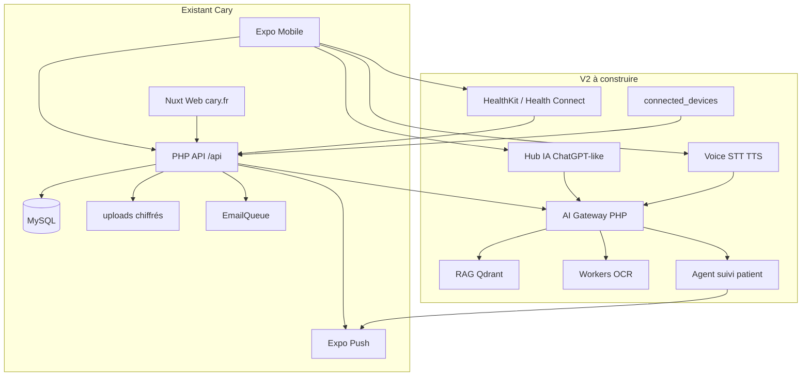
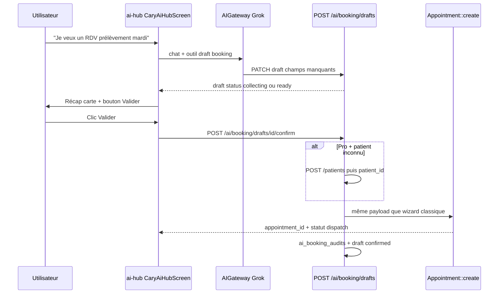
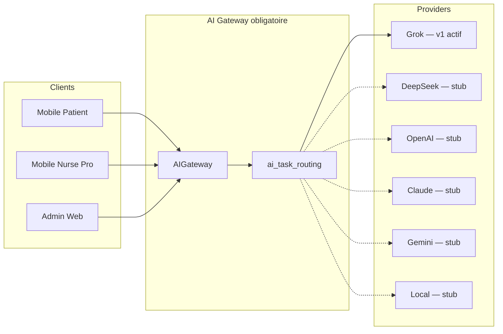
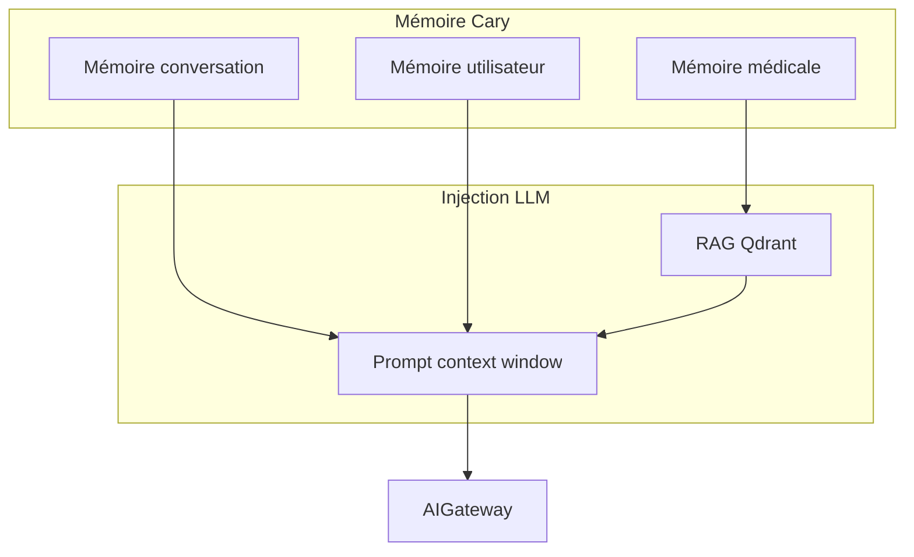

# Audit Cary / OneAndLab et prompt ingénieur V2 santé IA

## Index — 4 plans exécutables (lancer 1 par 1)

| # | Plan | Fichier | Contenu clé |
|---|------|---------|-------------|
| **1** | **Copilote intelligent** | [`cary_v2_ia_phase1_copilot.plan.md`](cary_v2_ia_phase1_copilot.plan.md) | Grok + **contexte SQL** (RDV, résultats, profil) + **prise RDV chat** § 2.7 + suggestions dynamiques + hub tous rôles |
| **2** | Santé connectée | [`cary_v2_ia_phase2_sante.plan.md`](cary_v2_ia_phase2_sante.plan.md) | Apple Health / Health Connect + onglet graphiques + métriques dans l'IA |
| **3** | RAG & intelligence profonde | [`cary_v2_ia_phase3_rag.plan.md`](cary_v2_ia_phase3_rag.plan.md) | Qdrant, OCR docs, mémoire, agent suivi, admin, pièces jointes |
| **4** | Voix & production | [`cary_v2_ia_phase4_avance.plan.md`](cary_v2_ia_phase4_avance.plan.md) | STT/TTS, tendances, recherche/archives, tests sécurité/charge |

**Démarrer par le Plan 1** — Cary est déjà utile (RDV + contexte dossier léger), pas un simple chatbot.

**Règle :** un seul plan fils ouvert à la fois. Ce fichier = référence audit, contraintes, § 2.7, infra.

### Numérotation migrations (075+)

| Plan | Migrations |
|------|------------|
| 1 | 075–078 (ai core + booking drafts) |
| 2 | 079–080 (health + devices) |
| 3 | 081–084 (memory, signals, reports, attachments) |
| 4 | 085–087 (voice, trends, feedback) |

---

## 1. Synthèse audit (état au 04/06/2026)

**Marque produit :** Cary (`cary.fr`, UI mobile/web). **Codebase :** monorepo `onev2` / packages `@oneandlab/*`.

| Domaine | Existant (à réutiliser) | Absent (greenfield) |
|---------|-------------------------|-------------------|
| **IA / LLM / RAG / OCR** | — | Tout le Module 2 |
| **Apple Health / Health Connect** | — | Tout le Module 1 |
| **Auth / RBAC** | OTP + JWT, [`AuthMiddleware.php`](backend/middleware/AuthMiddleware.php), [`RoleMiddleware.php`](backend/middleware/RoleMiddleware.php), [`PatientDossierAccess.php`](backend/lib/PatientDossierAccess.php) | Rôles dédiés « IA admin » (optionnel) |
| **Chiffrement HDS** | [`Crypto.php`](backend/lib/Crypto.php) AES-256-GCM, `medical_documents` chiffrés | Chiffrement métriques santé (nouvelles tables) |
| **Audit conformité** | [`access_logs`](database/migrations/007_create_access_logs.sql), API `/api/logs`, export CSV admin | Audit prompts/réponses IA (`ai_audits`) |
| **Documents médicaux** | Upload/list/download/copy — [`medical-documents/`](backend/api/medical-documents/) | Pipeline OCR + analyse |
| **Résultats labo** | Listing `document_type=resultats` — [`lab-results/`](backend/api/lab-results/) | Interprétation IA (avec garde-fous) |
| **RDV / dispatch** | [`Appointment.php`](backend/models/Appointment.php), offres atomiques, redispatch, lots | Moteur suggestion RDV (IA assistée) |
| **Profils publics SEO** | Migrations 019/030/034, pages Nuxt `/infirmier/:slug`, `/Laboratoire/:slug`, API [`public/nurse|lab`](backend/api/public/) | — |
| **Notifications** | In-app, Expo push, email queue, SMS Twilio — [`NotificationService.php`](backend/lib/NotificationService.php) | Événements « sync santé », « suggestion IA » |
| **Async / workers** | `EmailQueue` / `SmsQueue` + `register_shutdown_function`, crons [`backend/cron/`](backend/cron/) | **Pas de Redis** ni workers dédiés en prod |
| **Mobile** | Expo 54, rôles `patient|nurse|pro|preleveur` — voir [`docs/react-native-ingenieur-prompt.md`](docs/react-native-ingenieur-prompt.md) | Onglet « Mes données santé », assistants IA |
| **Web** | Nuxt 3 dashboards + booking — [`frontend/`](frontend/) | Cockpit IA admin, graphiques santé patient |
| **Voix / agents / wearables** | — | Module 4 entier (voice_*, connected_devices, agent suivi, tendances) |
| **UX IA native / hub conversationnel** | **Design mobile patient livré (mock)** — [`features/ai-hub/`](apps/mobile/src/features/ai-hub/), onglet [`(patient)/(tabs)/ai.tsx`](apps/mobile/app/(patient)/(tabs)/ai.tsx) | Backend Grok, persistance API, SSE, Markdown ; onglets `ai` pro/nurse/preleveur |
| **Bottom tabs mobile** | Patient : onglet **`ai`** avant `more` — [`(patient)/(tabs)/_layout.tsx`](apps/mobile/app/(patient)/(tabs)/_layout.tsx) | Onglet `ai` avant `more` pour **nurse, pro, preleveur** (même shell UI) |
| **Comptes rendus IA** | PDF ordonnance manuel [`PrescriptionPdf`](backend/lib/PrescriptionPdf.php) | Workflow brouillon → validation → `medical_documents` |
| **Routing multi-LLM par tâche** | — | `ai_task_routing` ; **v1 GrokProvider** + stubs autres |



**Écart majeur vs prompt générique :** le prompt original suppose Redis, WebSocket, workers multiples et tables IA — **aucun de ces éléments n’existe**. L’adaptation doit **étendre** les patterns PHP actuels (migrations `database/migrations/`, libs `backend/lib/`, features `apps/mobile/src/features/`) et introduire Redis/workers comme **jalon infra explicite**, pas comme acquis.

---

## 1 bis. Audit système RDV Cary (existant — source de vérité IA booking)

Document de référence : [`docs/comparaison-flux-pro-vs-formulaire-rdv.md`](docs/comparaison-flux-pro-vs-formulaire-rdv.md).

### Flux de création RDV aujourd’hui

| Flux | Entrée UI | Création patient | Endpoint final |
|------|-----------|------------------|----------------|
| **Patient connecté** | [`rendez-vous/nouveau.vue`](frontend/pages/rendez-vous/nouveau.vue) / mobile [`BookingWizardScreen`](apps/mobile/src/features/appointments/form/screens/BookingWizardScreen.tsx) | `patient_id` = utilisateur connecté ; proches via `relative_id` | `POST /appointments` |
| **Patient urgence lab** | Wizard + consentement | — | `POST /patient/booking-draft` → Stripe → webhook → [`PatientBookingDraftExecutor`](backend/lib/PatientBookingDraftExecutor.php) → `Appointment::create` |
| **Pro / infirmier / lab** | [`AppointmentForm`](frontend/components/dashboard/AppointmentForm.vue) / mobile [`useAppointmentForm`](apps/mobile/src/features/appointments/form/hooks/useAppointmentForm.ts) | Si `NEW_PATIENT` : **`POST /patients`** puis `patient_id` ; sinon lookup email [`GET /patients/lookup`](backend/api/patients/lookup.php) | `POST /appointments` |
| **Booking profil public** | Fiche `/infirmier/{slug}` | Patient connecté ou OTP invité | `POST /appointments` + `assigned_nurse_id` / `assigned_lab_id` |

**Backend unique :** [`backend/api/appointments/index.php`](backend/api/appointments/index.php) → [`Appointment::create`](backend/models/Appointment.php) → dispatch géographique (sauf assignation directe pro) → worker notifications [`process-appointment-notifications.php`](backend/scripts/process-appointment-notifications.php).

### Création patient par le pro (déjà en production)

- **API :** `POST /api/patients` — rôles `pro`, `nurse`, `lab`, `subaccount`, `super_admin` ([`patients/index.php`](backend/api/patients/index.php)).
- **Champs requis :** `first_name`, `last_name`, `phone` ; **email optionnel** pour pro/nurse/lab.
- **Anti-doublon :** hash email → 409 + `existing_patient_id` si déjà existant.
- **Mobile :** [`createPatient`](apps/mobile/src/features/patients/api/patients.service.ts) + [`CreatePatientModal`](apps/mobile/src/features/patients/components/CreatePatientModal.tsx) ; constante [`NEW_PATIENT_ID`](apps/mobile/src/features/appointments/form/types.ts).
- **Après RDV :** `linkPatientProfessional` (accès dossier) — [`patient_professional_access`](database/migrations/047_create_patient_professional_access.sql).

### Validation métier (à réutiliser pour l’IA)

- **Package partagé :** [`validateUnifiedRdvPayload`](packages/shared-utils/src/dashboard-unified-rdv.ts) — adresse géolocalisée, créneaux min 1 h, champs patient, services multiples.
- **Mobile :** [`buildSingleAppointmentPayload`](apps/mobile/src/features/appointments/form/hooks/useAppointmentForm.ts) / batch `creation_batch_id`.
- **Statuts :** patient → `pending` + dispatch ; nurse créateur soins → souvent `confirmed` + `assigned_nurse_id`.

### Ce que l’IA ne doit pas réinventer

L’IA **ne remplace pas** `POST /appointments` : elle produit un **brouillon validé** puis délègue la même chaîne métier (dispatch, notifications, documents) après clic **Valider** par l’humain.

---

## 2. Fichiers de référence obligatoires pour tout développeur

| Rôle | Document / chemin |
|------|-------------------|
| Vue métier | [`docs/plateforme-fonctionnalites-et-api.md`](docs/plateforme-fonctionnalites-et-api.md) |
| Mobile | [`docs/react-native-ingenieur-prompt.md`](docs/react-native-ingenieur-prompt.md), [`apps/mobile/AGENTS.md`](apps/mobile/AGENTS.md) (Expo v54) |
| Types partagés | [`packages/shared-types/`](packages/shared-types/), [`packages/shared-api/`](packages/shared-api/) |
| API | [`backend/api/index.php`](backend/api/index.php) (~86 endpoints) |
| Sécurité | [`backend/lib/Crypto.php`](backend/lib/Crypto.php), CSRF [`CSRFMiddleware.php`](backend/middleware/CSRFMiddleware.php) |

**Livrable documentaire proposé après validation :** `docs/cary-v2-sante-ia-prompt.md` (prompt ci-dessous + annexes schéma DB).

---

## 3. Prompt ingénieur adapté (à utiliser tel quel)

### PROMPT INGÉNIEUR LOGICIEL SENIOR — Cary / OneAndLab V2

Agis comme architecte logiciel senior pour **Cary** (plateforme de soins et prélèvements à domicile), en évoluant le monorepo **OneAndLab** (`/onev2`) **sans refonte** de l’existant.

**Stack actuelle (ne pas réinventer) :**
- **Backend :** PHP API-first, MySQL, routage [`backend/api/index.php`](backend/api/index.php), services [`backend/lib/`](backend/lib/), modèles [`backend/models/`](backend/models/).
- **Web :** Nuxt 3 [`frontend/`](frontend/) — SEO `cary.fr`, profils `/infirmier/{slug}`, `/Laboratoire/{slug}`.
- **Mobile :** Expo 54 / React Native [`apps/mobile/`](apps/mobile/) — rôles **uniquement** `patient`, `nurse`, `pro`, `preleveur` (`MOBILE_ROLES` dans [`packages/shared-constants`](packages/shared-constants/src/index.ts)). Rôles `lab`, `subaccount`, `super_admin` **restent web-only**.
- **Partagé :** `@oneandlab/shared-types`, `shared-utils`, `shared-api`, `shared-constants`.
- **Auth :** OTP email + JWT ; rôle relu en BDD via [`AuthMiddleware`](backend/middleware/AuthMiddleware.php). Mobile : reproduire CSRF + cookies ou accord backend Bearer-only pour mutations.
- **Données sensibles :** chiffrement AES-256-GCM HDS existant ([`Crypto`](backend/lib/Crypto.php)) pour profils et [`medical_documents`](database/migrations/011_create_medical_documents.sql).
- **Async actuel :** [`EmailQueue`](backend/lib/EmailQueue.php), [`SmsQueue`](backend/lib/SmsQueue.php), crons [`backend/cron/`](backend/cron/) — **pas de Redis aujourd’hui**.

**Objectif V2 :** augmenter Cary en plateforme santé intelligente **assistée** (pas autonome médicalement), en branchant IA et sync capteurs sur les modules déjà en production.

---

### CONTRAINTES GLOBALES (inchangées + ancrage Cary)

- Aucune prescription automatique ; aucune décision médicale automatique ; aucune recommandation = avis médical.
- Toute suggestion IA : **validation humaine** avant action métier (RDV, message patient, document publié).
- **Prise de RDV par l’IA :** autorisée uniquement via **brouillon + récap + clic Valider** ; jamais de `POST /appointments` sans confirmation explicite (voir § 2.7).
- Disclaimer configurable sur **chaque** réponse IA (texte admin, clé `ai_disclaimer_fr`).
- Traçabilité : tables `ai_*` + extension de [`access_logs`](database/migrations/007_create_access_logs.sql) pour actions sensibles.
- Historique intégral conversations ; audit prompts/réponses ; journalisation alignée HDS.
- **Couche LLM abstraite** (PHP `backend/lib/ai/`) :

```php
interface LLMProviderInterface {
    public function chat(array $messages, array $options = []): LLMResponse;
    public function complete(string $prompt, array $options = []): LLMResponse;
    public function transcribeAudio(string $audioPath, array $options = []): TranscriptionResponse; // Module 4
    public function synthesizeSpeech(string $text, array $options = []): SpeechResponse; // Module 4
}
// v1 : GrokProvider implémenté ; DeepSeekProvider, OpenAIProvider, ClaudeProvider, GeminiProvider, LocalProvider (stubs)
```

- **Stratégie fournisseurs :** architecture **multi-fournisseurs** extensible — chaque `task_type` peut cibler un provider différent via **`ai_task_routing`** (admin, sans redéploiement mobile). **Démarrage v1 : Grok (xAI) pour tous les types de tâche** ; bascule vers un autre provider = changement admin ou `.env`, pas de refonte feature.
- Config runtime : `ACTIVE_AI_PROVIDER=grok` (fallback global si routing absent) + clé `XAI_API_KEY` + table **`ai_task_routing`** (Module 04.7).
- **Règle absolue :** aucun code métier n’appelle un SDK fournisseur ; **100 % des appels IA passent par `AIGateway`** ([`backend/lib/ai/AIGateway.php`](backend/lib/ai/AIGateway.php)).

---

### MODULE 1 — Apple Health + Health Connect (greenfield)

**Mobile — nouvelle feature** `apps/mobile/src/features/health-sync/` :
- iOS : HealthKit (`expo-health` ou module natif documenté Expo 54) — métriques v1 : poids, taille, FC, pas, calories, distance, activité ; **sommeil** : types + API ingest seulement (UI graphique phase 2).
- Android : Health Connect — même jeu de métriques.
- UX : consentement explicite, sync manuelle / auto / background, historique des syncs, détection révocation permissions.
- Permissions : ajouter clés dans [`apps/mobile/app.json`](apps/mobile/app.json) / `app.config.js` (`NSHealthShareUsageDescription`, etc.).

**Backend — migrations nouvelles** (préfixe **`075+`** — dernière migration repo : **074** [`073_create_qr_tables`](database/migrations/073_create_qr_tables.sql), [`074_*`](database/migrations/)) :
- `health_sources` (patient_id, platform, external_source_id, revoked_at)
- `health_syncs` (source_id, status, started_at, finished_at, error, metrics_count)
- `health_metrics` (patient_id, metric_type ENUM, value, unit, recorded_at, source_id, external_id UNIQUE pour dédup)
- `health_permissions` (snapshot consentements)

**API** (sous `backend/api/health/` ) :
- `POST /health/metrics/batch` — ingest idempotent
- `GET /health/sources`, `GET /health/syncs`
- `DELETE /health/sources/{id}` — révocation RGPD

**Sécurité :** chiffrer valeurs sensibles comme profils (DEK par enregistrement ou agrégat journalier selon perf). Accès **patient only** ; staff **aucun accès** par défaut (sauf évolution produit tracée).

**Dashboard patient (mobile)** — nouvel onglet `(patient)` « Mes données santé » :
- Graphiques poids / activité / FC (ex. `victory-native` ou équivalent déjà dans le projet).
- Alertes **visuelles uniquement** (« valeur hors plage habituelle ») — jamais diagnostic.

**Réutiliser :** pattern device de [`push_device_tokens`](database/migrations/066_push_device_tokens.sql) pour lier appareil ↔ source santé.

---

### MODULE 2 — IA Cary augmentée (greenfield, branché sur l’existant)

#### 2.1 AI Gateway PHP

Nouveau namespace `backend/lib/ai/` :
- `AIGateway.php` : `analyzeDocument()`, `chat()`, `summarizePatient()`, `generateAppointmentSuggestion()`, `medicalExplanation()`, `ocrAnalysis()`
- Routing : **`ai_task_routing`** par type de tâche ; **v1 = Grok partout** (seed migration) ; bascule admin vers autre provider sans toucher au code métier.
- **OCR** : worker/cron (phase 1 : Tesseract ou API cloud **hors chemin synchrone HTTP**) — entrée = fichiers déjà dans [`medical_documents`](backend/api/medical-documents/index.php) après déchiffrement **en mémoire uniquement**, jamais stocker PDF clair.

#### 2.2 Contexte métier (RAG + prompts)

**Sources RAG (indexer progressivement) :**
- Profil patient chiffré (champs déchiffrés en worker)
- RDV : [`appointments`](database/migrations/002_create_appointments.sql) + statuts
- Documents : types `ordonnance`, `resultats`, etc.
- [`lab-results`](backend/api/lab-results/index.php) — métadonnées + texte extrait OCR
- Commentaires [`care_photo_comments`](database/migrations/050_care_photo_gallery.sql)
- Historique [`patient-history`](backend/api/patient-history/index.php)

**Vector store :** Qdrant (recommandé) ou Weaviate — service sidecar, **pas** dans MySQL. Collection par `patient_id` avec ACL stricte.

**Tables IA** (migrations dédiées) :
- `ai_conversations` — voir **Module 5** pour champs UX (`conversation_type`, `is_pinned`, `custom_title`, `archived_at`, `deleted_at`, `is_system`, `channel`)
- `ai_messages`, `ai_contexts`, `ai_audits`
- `ai_summaries` — résumés **documents** ; `ai_conversation_summaries` — résumés **conversations** (Module 5)
- `platform_settings` : disclaimer multilingue, température, quotas
- Voir Modules 4–5 : `ai_reports`, `ai_patient_signals`, `ai_task_routing`, `voice_*`, `ai_user_memory`, `ai_conversation_attachments`

#### 2.3 Assistants

| Assistant | Client | Contexte injecté |
|-----------|--------|------------------|
| **Patient** | Mobile `(patient)` + web patient | Profil, RDV à venir/passés, résultats (`lab-results`), docs patient, ordonnances archivées |
| **Professionnel** | Mobile `nurse`/`pro` + web pro | Dossier via [`PatientDossierAccess`](backend/lib/PatientDossierAccess.php), timeline RDV, derniers résultats, synthèse conversations |

**Capacités autorisées :** vulgarisation, résumé document, préparation RDV, **constitution d’un brouillon de prise de RDV** (§ 2.7), explication terme — **interdit** : diagnostic, traitement, prescription, **confirmation de RDV sans clic utilisateur**.

**Validation humaine :** pour `summarizePatient`, compte-rendu préconsultation, toute synthèse exportable → statut `draft` → bouton « Valider et enregistrer » → écriture dans `medical_documents` ou note RDV **uniquement après clic pro**.

#### 2.4 Analyse documents

Pipeline asynchrone :
1. Upload existant (inchangé)
2. Job `AiDocumentJob` (cron CLI ou queue Redis **phase infra**)
3. OCR → extraction structurée JSON → analyse LLM → résumé stocké `ai_summaries` lié à `medical_document_id`
4. Détection « valeur hors plage » = **flags informatifs**, pas diagnostic

#### 2.5 Moteur suggestion RDV

- Entrée : dernier `resultats`, date dernier bilan, métriques health (optionnel)
- Sortie : notification + carte mobile « Envisager un contrôle » — **jamais** `POST /appointments` automatique
- Workflow : suggestion → **pré-remplissage** wizard existant [`useAppointmentForm`](apps/mobile/src/features/appointments/form/hooks/useAppointmentForm.ts) / [`rendez-vous/nouveau.vue`](frontend/pages/rendez-vous/nouveau.vue) → validation utilisateur

#### 2.6 API REST (préfixe `/api/ai/`)

- `POST /ai/chat` — conversation patient ou pro (body: `conversation_id?`, `message`, `context_scope`)
- `GET /ai/conversations`, `GET /ai/conversations/{id}/messages`
- `DELETE /ai/conversations/{id}` — droit RGPD patient
- `POST /ai/documents/{medical_document_id}/analyze` — déclenche job
- `GET /ai/documents/{id}/summary`
- `POST /ai/patients/{id}/summarize` — pro only, sortie draft
- `GET /ai/suggestions` — suggestions RDV actives pour le patient connecté
- **Booking assisté (§ 2.7) :** `POST/GET/PATCH /ai/booking/drafts`, `POST /ai/booking/drafts/{id}/confirm`
- `GET /admin/ai/settings`, `PUT /admin/ai/settings` — super_admin web
- `GET /admin/ai/usage` — tokens, coûts, taux erreur

**Mobile :** feature existante [`apps/mobile/src/features/ai-hub/`](apps/mobile/src/features/ai-hub/) — **ne pas recréer de vues IA** ; Phase B = brancher `/ai/*` + partager le même shell pour **patient, nurse, pro, preleveur** (voir Module 5 § 05.1–05.2).


#### 2.7 — Prise de RDV assistée par l’IA (brouillon → récap → Valider)

**Principe :** l’IA **ne crée jamais** de RDV directement. Elle remplit un **`ai_appointment_draft`**, affiche un **récap** dans le fil chat ([`ai-hub`](apps/mobile/src/features/ai-hub/)), et seul un clic **Valider** déclenche la chaîne métier existante (`POST /patients` si besoin → `Appointment::create`).

**Réutilisation obligatoire :**
- Validation payload : [`validateUnifiedRdvPayload`](packages/shared-utils/src/dashboard-unified-rdv.ts)
- Création RDV : [`Appointment::create`](backend/models/Appointment.php) via [`appointments/index.php`](backend/api/appointments/index.php)
- Création patient pro : [`POST /patients`](backend/api/patients/index.php) — **uniquement au `confirm`**, pas pendant le chat
- Mobile pro : [`useAppointmentForm`](apps/mobile/src/features/appointments/form/hooks/useAppointmentForm.ts) / [`NEW_PATIENT_ID`](apps/mobile/src/features/appointments/form/types.ts)
- Urgence lab Stripe : flux [`patient/booking-draft`](backend/api/patient/booking-draft/) **inchangé** — l’IA peut pré-remplir le draft Stripe, jamais le contourner

**Tables (migration 078 — Plan 1) :**
- `ai_appointment_drafts` : `id`, `user_id`, `patient_id` (cible RDV), `conversation_id` nullable, `status` (`collecting`|`ready`|`confirmed`|`expired`|`cancelled`), `payload_json` (aligné unified RDV), `missing_fields_json`, `created_by_role`, timestamps, `expires_at`
- `ai_booking_audits` : `draft_id`, `action` (`create`|`patch`|`confirm`|`cancel`), `user_id`, `appointment_id` nullable, `ai_audit_id` nullable, `created_at`



**API booking :**

| Endpoint | Rôle | Description |
|----------|------|-------------|
| `POST /ai/booking/drafts` | patient, nurse, pro | Crée draft vide ou depuis message (`conversation_id`, `initial_intent?`) |
| `GET /ai/booking/drafts/{id}` | auteur | État + récap lisible + champs manquants |
| `PATCH /ai/booking/drafts/{id}` | auteur | Merge champs (`payload_json`) — validation partielle shared-utils |
| `POST /ai/booking/drafts/{id}/confirm` | auteur | **Seule** création RDV ; body optionnel derniers champs |

**Flux `confirm` (backend) :**
1. Vérifier `status = ready` et draft non expiré (`expires_at`, ex. 24 h)
2. Si `created_by_role` ∈ {nurse, pro} et `patient_mode = new` : **`POST /patients`** interne (mêmes règles 409 email)
3. Appeler **`validateUnifiedRdvPayload`** sur le payload final
4. **`Appointment::create`** — pas de raccourci parallèle
5. Si pro/nurse créateur : `linkPatientProfessional` si applicable
6. Mettre draft `confirmed`, lier `appointment_id`, écrire `ai_booking_audits` + `access_logs`

**UX mobile ([`ai-hub`](apps/mobile/src/features/ai-hub/) — design existant, pas nouvelle vue) :**
1. Chip « Prendre un rendez-vous » ou intent détecté dans le chat → crée/met à jour draft
2. L’assistant pose les questions manquantes **dans le fil** (adresse, créneau, type soin/prélèvement, proche…)
3. Quand `ready` : **carte récap** inline (même style bulle assistant) + CTA **Valider** / **Modifier**
4. **Valider** → loading → message succès avec lien vers détail RDV
5. **Modifier** → repasse en `collecting` ou deep link wizard [`BookingWizardScreen`](apps/mobile/src/features/appointments/form/screens/BookingWizardScreen.tsx) pré-rempli (`?draft_id=`)

**Différences par rôle au confirm :**

| Rôle | `patient_id` | Création patient | Dispatch |
|------|--------------|------------------|----------|
| `patient` | self ou `relative_id` | Non | Standard pending + dispatch |
| `nurse` / `pro` | existant ou **new au confirm** | Oui si new | Selon règles métier actuelles (souvent confirmed + assignation) |
| Suggestion agent 04.4 | self | Non | Idem patient |

**Garde-fous :**
- Jamais `POST /appointments` depuis le worker IA, cron ou `AIGateway` sans HTTP `confirm` utilisateur
- Disclaimer + mention « vérifiez le récap » sur chaque carte ready
- Traçabilité : `conversation_id`, `ai_audit_id` du tour LLM qui a finalisé le draft

**Tests obligatoires (Phase B) :**
- Patient : draft → récap → confirm → `appointment_id` + dispatch
- Pro + email inconnu : confirm → `POST /patients` → RDV
- Pro + email existant : confirm → 409 + proposition `existing_patient_id`
- Draft expiré → 410
- Non-auteur → 403 sur GET/PATCH/confirm

---

### MODULE 4 — IA vocale, agents intelligents et architecture future

**Objectif :** préparer Cary à des interactions naturelles (texte, voix, automatisations) **sans remplacer** les professionnels — réduction administrative, meilleur accompagnement patient. **Conception dès la Phase A** : tables et interfaces même si l’UI vocale est en Phase D.

**Principe transversal :** le Module 4 **s’appuie** sur les Modules 1–2 (pas de refonte) :
- Voix et chat texte partagent `ai_conversations` / `ai_messages` (champ `channel`: `text` | `voice`).
- Objets connectés alimentent `health_metrics` (Module 1) via `connected_devices`.
- Agent de suivi étend le moteur suggestions RDV (Module 2.5) + [`NotificationService`](backend/lib/NotificationService.php).
- Comptes rendus étendent `ai_summaries` avec workflow publication (Module 2.3).



#### 04.1 — Assistant vocal patient

**Objectif :** communiquer avec l’IA par la voix (ex. « Explique mon résultat », « Mon prochain RDV ? », « Résume mon dossier »).

**Fonctionnalités (Phase D UI, schéma Phase A) :**
- STT (reconnaissance) + TTS (synthèse) via `AIGateway::transcribe()` / `::synthesize()` — **v1 : Grok** (même routing `ai_task_routing` ; autre provider possible plus tard via admin).
- Conversation naturelle : même thread que chat texte ; bascule texte ↔ voix à tout moment.
- Historique vocal conservé (transcriptions + métadonnées audio chiffrées ou URLs signées courte durée).
- **Multilingue v1 :** FR (défaut), EN, AR, ES — champ `locale` sur `voice_sessions` ; prompts système i18n dans `platform_settings`.

**Mobile :** `apps/mobile/src/features/ai-voice/` — `expo-av` enregistrement, upload chunk vers API ; lecture TTS stream ou fichier.

**Tables (migration Phase A) :**
- `voice_sessions` (id, user_id, patient_id, ai_conversation_id nullable, locale, channel, started_at, ended_at)
- `voice_messages` (session_id, role user|assistant, audio_storage_key nullable, duration_ms, created_at)
- `voice_transcriptions` (voice_message_id, text, provider, confidence, language_detected)

**API** (`backend/api/ai/voice/`) :
- `POST /ai/voice/sessions` — démarre session (lie `conversation_id` optionnel)
- `POST /ai/voice/sessions/{id}/audio` — upload audio → transcription → `AIGateway::chat()` → TTS réponse
- `GET /ai/voice/sessions/{id}/messages`
- Même disclaimer et `ai_audits` que le chat texte.

**Garde-fous :** mêmes interdictions que Module 2 ; chaque réponse vocale = disclaimer lu en TTS (configurable « lire disclaimer » on/off).

#### 04.2 — Assistant vocal professionnel (dictée)

**Objectif :** dicter observations post-consultation ; l’IA produit un **brouillon** structuré — **aucune écriture directe** dans le dossier.

**Cas d’usage :** après RDV [`appointments`](database/migrations/002_create_appointments.sql), le pro dicte → brouillon : résumé structuré, note médicale, compte-rendu pré-consultation, entrée d’historique exploitable.

**Workflow :**
1. `POST /ai/voice/pro/dictate` (nurse/pro, `appointment_id`, audio ou texte transcrit)
2. `AIGateway` + contexte RAG patient (via [`PatientDossierAccess`](backend/lib/PatientDossierAccess.php))
3. Création `ai_reports` statut `draft` (voir 04.3)
4. UI validation dans fiche RDV mobile [`RdvDetail`](apps/mobile/src/features/appointments/detail/) ou web dashboard
5. Après validation manuelle uniquement : `POST /ai/reports/{id}/publish` → écriture [`medical_documents`](backend/api/medical-documents/index.php) ou note liée RDV

**Mobile :** bouton dictée sur écran détail RDV pro/infirmier ; réutiliser patterns [`generate-prescription`](backend/api/appointments/[id]/generate-prescription.php) (saisie → document, mais **IA = draft obligatoire**).

#### 04.3 — Compte rendu intelligent

**Objectif :** transformer notes, échanges et données en synthèses exploitables avec traçabilité complète.

**Types de génération** (enum `report_type`) :
- `consultation_summary`, `dossier_summary`, `lab_results_summary`, `appointments_history_summary`, `ai_conversation_summary`

**Table `ai_reports`** (Phase A) :
- `id`, `patient_id`, `appointment_id` nullable, `created_by`, `report_type`, `status` (`draft`|`validated`|`published`|`archived`), `content_json`, `content_text`, `source_ai_audit_id`, `published_medical_document_id` nullable, timestamps

**Workflow obligatoire :**
1. Création brouillon (IA ou dictée 04.2)
2. Validation humaine (pro) — écran diff avant/après
3. Publication → document chiffré ou entrée historique
4. Archivage + lien `access_logs`

**Réutiliser :** ne pas dupliquer [`PrescriptionPdf`](backend/lib/PrescriptionPdf.php) pour les synthèses IA ; PDF export optionnel **après** validation depuis `ai_reports` publié.

**API :**
- `POST /ai/reports/generate` — body `{ patient_id, report_type, appointment_id? }`
- `GET /ai/reports/{id}`, `PUT /ai/reports/{id}` — édition manuelle pré-validation
- `POST /ai/reports/{id}/validate`, `POST /ai/reports/{id}/publish`, `POST /ai/reports/{id}/archive`

#### 04.4 — Agent IA de suivi patient

**Objectif :** moteur de suivi **informatif** identifiant des situations où une action **peut** être pertinente pour le patient — sans automatisation médicale.

**Règles absolues — l’agent ne doit jamais :**
- prendre rendez-vous (`POST /appointments` interdit côté agent)
- prescrire ou diagnostiquer
- contacter un professionnel sans validation humaine explicite

**Cas d’usage (règles déterministes + enrichissement LLM optionnel) :**
| Signal | Source Cary existante | Action autorisée |
|--------|----------------------|------------------|
| Bilan non réalisé depuis X mois | `lab-results` + `medical_documents.resultats` | Suggestion + brouillon IA booking (§ 2.7) ou notif |
| Résultat reçu | Nouveau doc `resultats` + job analyse Module 2 | Notif + carte explicative |
| RDV non honoré | `appointments.status` annulé/no-show | Rappel informatif |
| Ordonnance bientôt expirée | docs `ordonnance` + date metadata | Suggestion contrôle |
| Document manquant | booking draft / RDV pending docs | Rappel upload |
| Profil incomplet | `profiles` champs requis | Rappel complétion |

**Tables (Phase A) :**
- `ai_patient_signals` (patient_id, signal_type, severity informational, payload_json, detected_at, dismissed_at, acted_at)
- `ai_agent_runs` (cron job id, patients_scanned, signals_created, run_at) — audit batch

**Workflow :**
1. Cron `backend/cron/ai-patient-followup.php` (quotidien) ou trigger post-upload résultat
2. Création signal + notification via [`NotificationService`](backend/lib/NotificationService.php)
3. Patient ouvre carte → hub IA crée `ai_appointment_draft` pré-rempli OU deep link wizard classique (`?suggestion_id=`)
4. **Clic Valider** sur récap (§ 2.7) = seule création RDV

**API :** `GET /ai/signals`, `POST /ai/signals/{id}/dismiss`, `POST /ai/signals/{id}/act` → retourne `{ draft_id }` ou `{ booking_wizard_params }` — **jamais** `appointment_id` créé côté `act`.

#### 04.5 — Objets connectés (extension Module 1)

**Objectif :** préparer l’ingestion multi-marques sans refonte de `health_metrics`.

**Appareils futurs (enum `device_vendor`) :** `apple_watch`, `garmin`, `fitbit`, `oura`, `withings`, `samsung_watch`, `connected_scale`, `bp_monitor`, `glucometer`, + `apple_health` / `health_connect` (agrégateurs Module 1).

**Tables (Phase A) :**
- `connected_devices` (patient_id, vendor, model, external_device_id, health_source_id FK nullable, paired_at, revoked_at)
- `device_syncs` (device_id, status, metrics_count, error, started_at, finished_at) — miroir `health_syncs`
- `device_measurements` — **vue logique** : en pratique **normaliser vers `health_metrics`** avec `source_type=device` et `connected_device_id` pour éviter deux pipelines d’ingest.

**Types métriques étendus** (ENUM `metric_type`) : poids, taille, activité, sommeil, FC, VO2max, tension, glycémie, température, SpO2 — champs réservés NULL en v1.

**API :** `POST /health/devices/pair`, `POST /health/devices/{id}/sync`, `DELETE /health/devices/{id}` — réutilise `POST /health/metrics/batch`.

#### 04.6 — Moteur de prédiction et tendances (descriptif uniquement)

**Objectif :** analyser l’évolution temporelle ; produire **observations et tendances**, jamais diagnostic ni conclusion médicale.

**Exemples de sorties autorisées :** « Poids en légère baisse sur 30 jours », « Activité inférieure à votre moyenne », « Pas de bilan uploadé depuis 12 mois ».

**Table `ai_trends`** (Phase A, calcul Phase D) :
- `patient_id`, `metric_type` nullable, `trend_key`, `observation_fr`, `observation_en` nullable, `window_days`, `computed_at`, `data_points_count`

**Service :** `backend/lib/ai/TrendEngine.php` — règles statistiques simples (régression linéaire, seuils configurables admin) ; LLM optionnel **uniquement** pour reformulation descriptive via `AIGateway` avec prompt interdisant diagnostic.

**UI patient :** section dans onglet « Mes données santé » — badges informatifs, pas d’alerte médicale.

#### 04.7 — IA multi-fournisseurs et routing intelligent

**Objectif :** zéro dépendance code métier à un SDK ; changement Grok → GPT/Claude/DeepSeek/local **par `task_type`** sans toucher aux features.

**Implémentations** (`backend/lib/ai/providers/`) :
- **`GrokProvider`** — **seul provider fully implémenté en v1** (chat, complete, STT/TTS si API xAI le permet ; sinon STT/TTS reportés Phase D avec même interface)
- `DeepSeekProvider`, `OpenAIProvider`, `ClaudeProvider`, `GeminiProvider` — **stubs Phase A** (erreur contrôlée « provider non activé ») ; implémentation à la demande
- `LocalProvider` — stub on-prem futur

**Table `ai_task_routing`** :
- `task_type` ENUM : `chat_simple`, `chat_complex`, `medical_summary`, `document_analysis`, `ocr`, `voice_agent`, `voice_transcription`, `trend_wording`, `appointment_suggestion`
- `provider` ENUM, `model` varchar nullable, `priority` int, `enabled`

**Seed migration v1 (Grok partout — modifiable admin) :**

| task_type | provider | model (ex.) |
|-----------|----------|-------------|
| chat_simple | grok | grok-3 |
| chat_complex | grok | grok-3 |
| medical_summary | grok | grok-3 |
| document_analysis | grok | grok-3 |
| ocr | grok | grok-3 |
| voice_agent | grok | grok-3 |
| voice_transcription | grok | grok-3 |
| trend_wording | grok | grok-3 |
| appointment_suggestion | grok | grok-3 |

**Exemple bascule ultérieure (sans redéploiement) :** admin met `medical_summary` → `claude` + `claude-sonnet-4` une fois `ClaudeProvider` activé.

**`AIGateway::resolveProvider(string $taskType)`** — lit `ai_task_routing` + cache ; fallback `ACTIVE_AI_PROVIDER` ; log chaque choix dans `ai_audits`.

#### 04.8 — Agent administrateur IA (cockpit étendu)

**Extension** de la section « Cockpit IA » (web `super_admin` uniquement) — [`frontend/pages/admin/`](frontend/pages/admin/) :

**Dashboard métriques :**
- Conversations texte vs voix (`ai_conversations.channel`)
- Analyses documents / rapports générés
- Coût estimé **par fournisseur** (agrégation `ai_audits.tokens * tarif config`)
- Temps de réponse p50/p95, taux d’erreur
- Satisfaction (table future `ai_feedback` : thumbs + commentaire optionnel)
- Usage patient vs pro (filtre `user.role`)

**Audit complet (déjà `ai_audits`, UI enrichie) :**
- Prompt (hash + extrait), réponse (extrait), modèle, latence, tokens, `user_id`, `patient_id` si applicable
- Export CSV aligné [`access_logs`](database/migrations/007_create_access_logs.sql) / logs HDS admin
- Actions RGPD : suppression conversation, export patient, anonymisation

**API admin :** `GET /admin/ai/dashboard`, `GET /admin/ai/audits`, `PUT /admin/ai/routing`, `GET /admin/ai/routing`

#### Architecture obligatoire Module 4 (checklist développeur)

1. Toute feature IA/vocale/agent → **un seul point d’entrée** : `AIGateway`.
2. Schémas DB Module 4 créés en **Phase A** même si UI Phase D.
3. `connected_devices` → normalisation **`health_metrics`** (un pipeline graphiques).
4. `voice_*` lié à `ai_conversations` (pas de silo parallèle).
5. `ai_reports` / agent suivi : statuts `draft` avant toute écriture [`medical_documents`](database/migrations/011_create_medical_documents.sql).
6. Types partagés dans `@oneandlab/shared-types` : `VoiceSession`, `AiReport`, `AiPatientSignal`, `AiTrend`, `AiTaskType`.

---

### MODULE 5 — Expérience IA, mémoire et UX conversationnelle

**Objectif :** faire de Cary une **plateforme IA native** (pas un chatbot ajouté). UX inspirée des meilleures pratiques ChatGPT, adaptée au contexte santé : disclaimer, validation humaine pour actes métier, pas de diagnostic. L’IA est un **copilote santé** accessible depuis tous les parcours.

**Positionnement produit :** l’utilisateur doit percevoir Cary comme son assistant santé personnel, son historique médical intelligent et son copilote quotidien.

#### 05.1 — Navigation principale mobile (obligatoire)

**Règle produit : conserver le design IA mobile déjà validé côté patient — aucune refonte UI.**

**Existant patient (à ne pas refaire) :**
- Onglet **`ai`** avant **`more`** — [`apps/mobile/app/(patient)/(tabs)/_layout.tsx`](apps/mobile/app/(patient)/(tabs)/_layout.tsx) (icône `face.smiling` / « Assistant Cary »)
- Route [`apps/mobile/app/(patient)/(tabs)/ai.tsx`](apps/mobile/app/(patient)/(tabs)/ai.tsx) → [`PatientAiMockScreen`](apps/mobile/src/features/ai-hub/screens/PatientAiMockScreen.tsx)
- Composants partagés : [`PatientAiChatFooter`](apps/mobile/src/features/ai-hub/components/PatientAiChatFooter.tsx), [`PatientAiConversationsSheet`](apps/mobile/src/features/ai-hub/components/PatientAiConversationsSheet.tsx), [`PatientAiVoiceMockOverlay`](apps/mobile/src/features/ai-hub/components/PatientAiVoiceMockOverlay.tsx), etc.

**À faire — même UI pour les pros :**

| Fichier | Action |
|---------|--------|
| [`apps/mobile/app/(nurse)/(tabs)/_layout.tsx`](apps/mobile/app/(nurse)/(tabs)/_layout.tsx) | Ajouter onglet **`ai`** immédiatement avant **`more`** (même icône / label) |
| [`apps/mobile/app/(pro)/(tabs)/_layout.tsx`](apps/mobile/app/(pro)/(tabs)/_layout.tsx) | Idem |
| [`apps/mobile/app/(preleveur)/(tabs)/_layout.tsx`](apps/mobile/app/(preleveur)/(tabs)/_layout.tsx) | Idem |
| `apps/mobile/app/(nurse\|pro\|preleveur)/(tabs)/ai.tsx` | Wrapper mince identique au patient — **même écran hub** |

**Refactor Phase B (nommage, pas redesign) :**
- Extraire un écran **`CaryAiHubScreen`** (ou renommer `PatientAiMockScreen`) avec prop **`role: MobileRole`**
- Renommer progressivement `PatientAi*` → **`CaryAi*`** quand le composant est partagé multi-rôles
- Config par rôle : `getAiHubRoleConfig(role)` — greeting, chips suggestions, `context_scope` API, conversation système (`assistant_health` vs `assistant_professional`)

**Point d'entrée :** chat conversationnel direct (fil + footer composer) ; historique via **sheet** latérale (design actuel) — pas de menu intermédiaire.

**Stack routes v1 :** un seul onglet `(tabs)/ai.tsx` par rôle suffit ; stack `ai/[conversationId]` **optionnel** si deep link nécessaire plus tard.

#### 05.2 — Hub conversationnel (design existant — brancher backend)

**Feature unique :** [`apps/mobile/src/features/ai-hub/`](apps/mobile/src/features/ai-hub/) — **source de vérité UI** pour tous les rôles mobile. **Interdit :** dupliquer les vues dans `ai-assistant/` ou recréer un second design chat.

**Écran actuel (patient, mock Phase B-0) — à conserver tel quel visuellement :**
- Fil chat : bulles user/assistant, avatar Cary, chips suggestions welcome
- Footer : composer + bouton voix + bannière demo ([`PatientAiDemoBanner`](apps/mobile/src/features/ai-hub/components/PatientAiDemoBanner.tsx))
- Historique : [`PatientAiConversationsSheet`](apps/mobile/src/features/ai-hub/components/PatientAiConversationsSheet.tsx) (menu header)
- Voix : overlay mock [`PatientAiVoiceMockOverlay`](apps/mobile/src/features/ai-hub/components/PatientAiVoiceMockOverlay.tsx) → brancher Module 4 Phase D
- Suggestions mock : [`patient-ai-mock.ts`](apps/mobile/src/features/ai-hub/constants/patient-ai-mock.ts) → remplacer par `GET /ai/quick-suggestions` + config pro

**Différences par rôle (données / contexte uniquement — pas de layout différent) :**

| Rôle | Titre header | Conversation système | Suggestions chips (ex.) | Contexte RAG |
|------|--------------|----------------------|---------------------------|--------------|
| `patient` | Assistant Cary | `assistant_health` | RDV, résultats, dossier, tendances santé | Dossier self + proches |
| `nurse` | Assistant Cary | `assistant_professional` | Synthèse patient, prep RDV, dictée (Phase D) | Patients via `PatientDossierAccess` |
| `pro` | Assistant Cary | `assistant_professional` | RDV patient, créer patient, résumer dossier | Idem pro |
| `preleveur` | Assistant Cary | `assistant_professional` (périmètre limité) | Prep tournée, RDV assignés | Sous-ensemble métier |

**Phase B — travail UI = câblage, pas redesign :**
1. Remplacer `use-patient-ai-conversations` mock → `useAiConversations` API
2. Remplacer `pickPatientAiMockReply` → `POST /ai/chat` puis **SSE** `POST /ai/chat/stream`
3. Ajouter rendu **Markdown** dans les bulles assistant (composant existant, pas nouveau layout)
4. Disclaimer footer (texte admin) — intégrer dans [`PatientAiChatFooter`](apps/mobile/src/features/ai-hub/components/PatientAiChatFooter.tsx)
5. Retirer bannière demo quand backend live

**Extensions ultérieures dans le même shell (pas nouvel écran) :** épinglage, recherche globale, section Archives — enrichir la sheet historique ou header, sans changer le fil chat.

**Web patient (phase ultérieure) :** miroir optionnel `frontend/pages/patient/ia/` — mobile prioritaire Phase B.

#### 05.3 — Assistant Santé permanent (conversation système)

**Création automatique** à la première connexion patient (`POST /auth/verify-otp` ou hook `GET /auth/me` si absente).

| Champ | Valeur |
|-------|--------|
| `is_system` | `true` |
| `system_key` | `assistant_health` |
| `custom_title` | `Mon Assistant Santé` |
| `conversation_type` | `assistant_health` |
| `is_pinned` | `true` (forcé) |
| `archived_at` | NULL (interdit) |
| `deleted_at` | NULL (interdit suppression) |

**Règles API :** `DELETE /ai/conversations/{id}` retourne **403** si `is_system=true`. `PATCH` ne peut pas désépingler ni archiver cette conversation.

**Contexte RAG injecté automatiquement** (mémoire médicale — 05.5) :
- Dossier patient ([`patients`](backend/api/patients/), profil chiffré)
- RDV ([`appointments`](backend/api/appointments/index.php))
- Résultats ([`lab-results`](backend/api/lab-results/index.php))
- Documents ([`medical-documents`](backend/api/medical-documents/), [`patient-documents`](backend/api/patient-documents/))
- Métriques Module 1 (`health_metrics`, HealthKit / Health Connect)
- Résumés IA (`ai_summaries`, `ai_reports` publiés)
- Historique Cary ([`patient-history`](backend/api/patient-history/index.php))

**Variantes rôle pro (nurse/pro) :** conversation système `assistant_professional` — titre « Mon Assistant Cary Pro », contexte limité aux patients accessibles via [`PatientDossierAccess`](backend/lib/PatientDossierAccess.php) ; pas d’accès dossier hors périmètre.

#### 05.4 — Conversations multiples et types

Comportement **type ChatGPT** : conversations illimitées, persistance totale, reprise exacte après mois d’inactivité.

**Enum `conversation_type` :**
- `general`
- `assistant_health` (système patient)
- `lab_results`
- `medical_document`
- `appointment`
- `health_tracking`
- `professional` (nurse/pro)
- `voice` (lien `voice_sessions` Module 4)

**Champs `ai_conversations` (migration Phase A, compléter Module 2) :**
- `id`, `user_id`, `patient_id` (patient concerné — self ou proche selon contexte)
- `conversation_type`, `channel` (`text`|`voice`)
- `custom_title` nullable (renommage utilisateur)
- `is_pinned` boolean default false
- `is_system`, `system_key` nullable
- `archived_at`, `deleted_at` nullable (soft delete RGPD)
- `last_message_at`, `message_count`, `created_at`, `updated_at`
- `metadata_json` (liens : `appointment_id`, `medical_document_id`, etc.)

**API conversations :**
- `GET /ai/conversations` — liste (filtres: pinned, archived, type, q search)
- `POST /ai/conversations` — nouvelle (`conversation_type`, `custom_title?`, `context_refs?`)
- `PATCH /ai/conversations/{id}` — rename, pin, archive, unarchive
- `DELETE /ai/conversations/{id}` — soft delete (`deleted_at`) sauf système

#### 05.5 — Mémoire IA multi-niveaux



**A. Mémoire de conversation** (`ai_conversation_summaries` + messages)
- Historique complet `ai_messages` — **aucune suppression auto**
- Résumé rolling stocké dans `ai_conversation_summaries` (voir 05.6)
- Injecté : derniers N messages + dernier résumé

**B. Mémoire utilisateur** — table `ai_user_memory`
- `user_id`, `key`, `value_encrypted`, `dek`, `category` (`preference`|`locale`|`habit`|`other_non_medical`)
- Ex. langue préférée, ton réponses, rappels UX — **pas de données médicales**

**C. Mémoire médicale** — table `ai_medical_memory` (cache structuré + RAG)
- `patient_id`, `snapshot_type`, `content_json`, `content_hash`, `refreshed_at`
- Types : `dossier`, `appointments_recent`, `lab_results_index`, `documents_index`, `health_metrics_summary`
- Régénération : cron ou invalidation sur upload doc / nouveau RDV / sync health
- **Injectée automatiquement** dans RAG pour `assistant_health` et conversations liées dossier

**Service :** `backend/lib/ai/MemoryComposer.php` — assemble les 3 niveaux avant chaque appel `AIGateway::chat()`.

#### 05.6 — Résumés automatiques de conversation

**Table `ai_conversation_summaries` :**
- `conversation_id`, `summary_text`, `covers_message_id_until`, `token_count_estimate`, `created_at`

**Règle :** tous les **X messages** (config admin, défaut 20) → job async `AiConversationSummarizeJob` :
1. Résumer l’historique non encore résumé
2. Stocker dans `ai_conversation_summaries`
3. Envoyer au LLM : résumé(s) + messages récents seulement → **réduction coût tokens**
4. Conserver historique intégral en BDD (jamais supprimé pour affichage UI)

#### 05.7 — Épinglage, renommage, archivage, RGPD

| Fonction | Champ / API |
|----------|-------------|
| Épingler / désépingler | `is_pinned` — `PATCH` (sauf système : pin forcé) |
| Renommer | `custom_title` — ex. « Résultats Mars 2026 », « Suivi Vitamine D » |
| Archiver / restaurer | `archived_at` — masqué du hub principal, visible section Archives |
| Suppression RGPD | `deleted_at` — masque conversation + option purge messages (`purge_messages` flag) |
| Export IA | `GET /ai/export` — JSON/ZIP conversations + messages + audits pour le patient connecté |

**Tri hub :** 1) système, 2) épinglées par `updated_at`, 3) récentes.

#### 05.8 — Recherche IA globale

**API :** `GET /ai/search?q=ferritine|vitamine D|prise de sang`

**Sources indexées :**
- `ai_conversations.custom_title`
- `ai_messages.content` (FULLTEXT MySQL ou index Qdrant parallèle)
- `ai_conversation_summaries.summary_text`
- Métadonnées documents liés (`ai_conversation_attachments` → `medical_documents`)

**Réponse :** groupes `{ conversations[], messages[], summaries[], documents[] }` avec extraits surlignés.

#### 05.9 — Chat multimodal et pièces jointes

**Table `ai_conversation_attachments` :**
- `id`, `conversation_id`, `message_id` nullable, `medical_document_id` nullable, `attachment_type` (`pdf`|`image`|`ordonnance`|`resultats`|`other`)
- `storage_key`, `mime_type`, `file_name`, `created_at`

**Workflow :**
1. Utilisateur joint PDF/image/doc existant ou upload nouveau → réutilise pipeline [`medical-documents`](backend/api/medical-documents/index.php) puis lien attachment
2. Message utilisateur référence `attachment_ids[]`
3. `AIGateway` + OCR Module 2 si besoin → réponse avec **citations** (`citation_refs[]` dans `ai_messages.metadata_json`)

**Architecture multimodale (même conversation) :**
- `text` — v1 Phase B
- `voice` — Phase D (Module 4)
- `image` / `pdf` / doc médical — Phase B attachments, analyse async

#### 05.10 — Expérience chat (design existant + backend)

**Écran chat :** [`PatientAiMockScreen`](apps/mobile/src/features/ai-hub/screens/PatientAiMockScreen.tsx) → **`CaryAiHubScreen`** partagé — **ne pas créer `AiChatScreen` parallèle**.

**Déjà en place (UI) :** bulles user/assistant, scroll auto, indicateur « Cary réfléchit… », chips suggestions, composer sticky clavier.

**Phase B — à brancher sur le design existant :**
- **Streaming SSE** : `POST /ai/chat/stream` — chunks token par token (fallback polling si infra limite)
- Rendu **Markdown** dans bulles assistant (`react-native-markdown-display` ou équivalent)
- **Citations** : liens cliquables dans bulle → sheet doc/RDV existants
- Toggle **texte ↔ voix** (Module 4) — bouton voix déjà dans le footer
- Disclaimer en footer + première réponse de session

**Patterns scroll :** réutiliser [`liquid-glass-header-inset`](apps/mobile/src/components/navigation/liquid-glass-header-inset.ts) déjà branché sur l'écran patient.

#### 05.11 — Entrées contextuelles depuis les autres parcours

L’IA doit être joignable **hors de l’onglet IA** via deep links :

| Parcours existant | Action | Paramètres |
|-------------------|--------|------------|
| [`lab-results`](apps/mobile/src/features/lab-results/) | « Demander à Cary » | `conversation_type=lab_results`, prefill context |
| Détail RDV patient | « Préparer ce RDV » | `appointment_id` contexte |
| Chat IA | « Je veux un RDV pour… » | `POST /ai/booking/drafts` → récap → Valider |
| Pro — fiche patient / chat | RDV pour patient inconnu | brouillon + `create_new` au confirm → `POST /patients` puis RDV |
| Documents patient | « Analyser ce document » | `medical_document_id` |
| Onglet santé Module 1 | « Mes tendances » | `health_tracking` |
| Notification agent 04.4 | Ouvre hub + signal | `suggestion_id` |

**Implémentation :** `router.push('/(role)/(tabs)/ai?...')` — même onglet pour patient et pro ; paramètres `conversation_type`, `initialMessage`, `appointment_id`, etc.

#### 05.12 — Suggestions intelligentes (hub)

Chips dynamiques basées sur données réelles (pas statiques) :
- « Explique mes derniers résultats » — si `lab-results` récents
- « Résume mon dossier » — toujours (assistant_health)
- « Prépare mon prochain rendez-vous » / « Prendre un rendez-vous » — lance brouillon § 2.7
- « Analyse mes documents » — si docs non analysés
- « Montre mes tendances santé » — si `health_metrics` ou Module 04.6

Génération : `GET /ai/quick-suggestions` — règles métier + optionnel LLM pour libellés.

#### 05.13 — API complémentaires Module 5

- `GET /ai/hub` — payload agrégé hub (système + pinned + recent + suggestions)
- `POST /ai/conversations/{id}/messages` — message (non-stream)
- `POST /ai/chat/stream` — SSE streaming
- `GET /ai/conversations/{id}/messages?cursor=`
- `POST /ai/conversations/{id}/attachments`
- `GET /ai/search?q=`
- `GET /ai/export`
- `POST /ai/conversations/ensure-system` — idempotent création assistant santé

#### 05.14 — Architecture obligatoire Module 5 (checklist)

1. **Un seul module UI** [`features/ai-hub/`](apps/mobile/src/features/ai-hub/) — patient + nurse + pro + preleveur ; **pas de second design chat**.
2. Onglet **`ai` avant `more`** — patient ✅ ; **à ajouter** nurse, pro, preleveur.
3. Conversation système créée **automatiquement** — jamais supprimable/archivable.
4. **Aucune perte de contexte** : messages persistés ; résumés = compression LLM seulement.
5. Tous les appels LLM → `AIGateway` + `MemoryComposer` + disclaimer.
6. Types `@oneandlab/shared-types` : `AiConversation`, `ConversationType`, `AiHubPayload`, `AiMessage`, `AiAttachment`.
7. WebSocket optionnel Phase C ; **SSE suffit** pour streaming Phase B.
8. Prise de RDV : toujours **brouillon → récap → Valider** (§ 2.7) ; cartes récap dans le fil de chat existant.

---

### NOTIFICATIONS (extension)

Réutiliser [`NotificationService`](backend/lib/NotificationService.php) + types dans [`Notification.php`](backend/models/Notification.php) :
- Nouveaux types : `health_sync_completed`, `ai_suggestion_available`, `lab_results_ai_summary_ready`, `ai_signal_detected`, `ai_report_ready_for_validation`, `voice_session_summary` (informatif)
- Push via [`ExpoPushService`](backend/lib/ExpoPushService.php)
- Email/SMS : files existantes
- **WhatsApp Business :** interface `NotificationChannelInterface` + stub `WhatsAppChannel` (non activé)

---

### ADMINISTRATION — Cockpit IA (Modules 2 + 04.8)

**Web-only** `frontend/pages/admin/ai/` (rôle `super_admin`) :
- Provider actif, **routing par `task_type`** (table `ai_task_routing`), température, quotas
- Dashboard : conversations, analyses, coûts par fournisseur, latence, erreurs, satisfaction, usage patient/pro
- Logs `ai_audits` + `voice_transcriptions` + `ai_agent_runs` — export CSV (comme logs HDS)
- Édition disclaimer multilingue (FR/EN/AR/ES)

Ne pas dupliquer sur mobile.

---

### SÉCURITÉ & PERFORMANCE (adapté infra réelle)

| Exigence prompt générique | Adaptation Cary |
|-------------------------|-----------------|
| Redis queues | **Phase 0 :** scripts CLI + cron + shutdown queue ; **Phase 1 :** Redis + workers si charge OCR/IA |
| WebSocket temps réel | Chat IA : **SSE** `POST /ai/chat/stream` (Module 5, Phase B) ; WebSocket optionnel Phase C ; notifications = polling 60s existant |
| Cache | Cache fichier/APCu côté PHP pour settings IA ; CDN images profils publics |
| RBAC | Étendre `RoleMiddleware` + vérifier `PatientDossierAccess` sur chaque endpoint `/ai/patients/{id}/*` |
| TLS / AES | Déjà en place ; nouvelles tables health/ai même norme |

---

### ÉVOLUTIONS HORS SCOPE V2 (hooks prévus Module 4)

Téléconsultation, analyse d’imagerie assistée, agent vocal temps réel full-duplex, ECG watch — réservés ; schémas `metric_type` et `ai_task_routing` extensibles sans migration breaking.

---

### LIVRABLES ATTENDUS (par phase)

**Phase A — Fondations (4–6 sem.)**
- Migrations : `health_*`, `ai_*` **étendu Module 5**, **`ai_appointment_drafts`, `ai_booking_audits`**, `voice_*`, `connected_devices`, `ai_reports`, `ai_patient_signals`, `ai_trends`, `ai_task_routing`, `ai_conversation_summaries`, `ai_user_memory`, `ai_medical_memory`, `ai_conversation_attachments`
- `LLMProviderInterface` + **`GrokProvider` v1** + stubs autres providers + `AIGateway` + `MemoryComposer` + seed `ai_task_routing` (Grok tous task_type)
- API `/health/*`, `/ai/conversations` CRUD, `ensure-system`, `/ai/chat` (non-stream), tables audit
- Doc : schéma DB complet Modules 1–2, 4–5, `docs/cary-v2-sante-ia-prompt.md`

**Phase B — Produit (6–8 sem.) — priorité UX IA native (Module 5)**
- **Réutiliser `ai-hub` patient** : brancher Grok/SSE + onglet `ai` **pro/nurse/preleveur** (même composants, config par rôle)
- Épinglage / recherche / archives : extensions sheet historique (pas nouvel écran)
- Health sync + `connected_devices` → `health_metrics`
- RAG Qdrant + OCR async + pièces jointes conversation + citations
- `ai_reports` workflow + agent suivi (Module 04.4)
- Cockpit admin IA v1

**Phase C — Hardening**
- Tests PHPUnit (`backend/tests/ai/`), tests mobile ciblés, charge OCR + batch health
- Audit sécurité (prompt injection, fuite contexte inter-patients, audio RGPD)
- Feature flags ; non-régression 86 endpoints existants

**Phase D — Voix et tendances (6–8 sem., après B stable)**
- Assistant vocal patient (STT/TTS, multilingue FR/EN/AR/ES)
- Dictée pro post-RDV (04.2)
- `TrendEngine` + UI tendances descriptives onglet santé
- Routing vocal optimisé admin ; satisfaction `ai_feedback`

**Tests obligatoires :**
- Unitaire : providers LLM mockés, dédup health metrics, ACL RAG
- Intégration : upload doc → job → summary ; chat avec disclaimer
- Charge : batch health 10k points ; file OCR
- Non-régression : [`medical-documents`](backend/api/medical-documents/), booking patient, profils publics, **navigation tabs existants** (ordre onglets hors `ai` inchangé)
- Module 5 : test E2E onglet IA → assistant système → nouvelle conversation → stream → reprise après 30j simulé
- § 2.7 : test brouillon IA → récap → Valider → `appointment_id` ; test pro nouveau patient au `confirm` ; test 409 email doublon ; audit `ai_booking_audits`

---

### RÈGLES D’IMPLÉMENTATION (spécifiques repo)

1. **Migrations** : un fichier numéroté dans [`database/migrations/`](database/migrations/) + entrée dans `all-migrations.sql`.
2. **API** : nouveau dossier sous `backend/api/` ; enregistrement routage dans [`backend/api/index.php`](backend/api/index.php).
3. **Mobile** : **un seul** feature folder [`features/ai-hub/`](apps/mobile/src/features/ai-hub/) ; routes `(role)/(tabs)/ai.tsx` = wrappers minces ; pas de logique métier dans les écrans route.
4. **Types** : ajouter dans `@oneandlab/shared-types` avant usage mobile/web.
5. **Ne pas casser** : OTP, CSRF web, Stripe [`subscriptions`](database/migrations/026_create_subscriptions.sql), dispatch RDV.
6. **Nom produit UI** : « Cary » ; packages npm restent `@oneandlab/*`.

---

## 4. Matrice prompt générique → statut Cary

| Bloc prompt original | Statut | Action |
|---------------------|--------|--------|
| HealthKit / Health Connect | 0 % | Module 1 greenfield |
| AI Gateway / multi-LLM | 0 % | Module 2 — `GrokProvider` v1 + `AIGateway` |
| RAG Qdrant | 0 % | Sidecar + workers |
| Assistants patient/pro | 0 % | S’appuie sur lab-results, medical-docs, appointments |
| OCR / analyse docs | 0 % | Hook post-upload `medical_documents` |
| Suggestion / prise RDV IA | 0 % | § 2.7 brouillon + Valider ; réutilise `POST /appointments` + `POST /patients` |
| Création patient pro via IA | ~100 % API | Enrobage § 2.7 au `confirm` uniquement |
| Profil public SEO | ~90 % | [`frontend/pages/infirmier/`](frontend/pages/infirmier/) |
| Notifications push/email/SMS | ~80 % | Étendre types |
| Cockpit IA admin | 0 % | Page Nuxt admin |
| Redis / WebSocket | 0 % | Jalon infra explicite |
| Chiffrement / audit HDS | ~70 % | Étendre à `ai_audits` + health + voice |
| Assistant vocal patient | 0 % | Module 04.1 — Phase D |
| Dictée pro / comptes rendus IA | 0 % | Module 04.2–04.3 — Phase B draft, Phase D voix |
| Agent suivi patient | 0 % | Module 04.4 — Phase B (cron + signals) |
| Objets connectés multi-marques | 0 % | Module 04.5 — schéma Phase A, sync Phase B |
| Moteur tendances descriptif | 0 % | Module 04.6 — Phase D |
| Routing multi-LLM par tâche | 0 % | Module 04.7 — seed Grok, bascule admin |
| Cockpit admin IA étendu | 0 % | Module 04.8 — Phase B/C |
| Hub IA / onglet bottom nav | **~40 % UI patient mock** | Module 05 — brancher API ; onglets pro/nurse/preleveur ; **pas de redesign** |
| Mon Assistant Santé système | 0 % | Module 05.3 — `ensure-system` à la connexion |
| Mémoire 3 niveaux + résumés conv. | 0 % | Module 05.5–05.6 — Phase A schema, Phase B jobs |
| Streaming SSE chat | 0 % | Module 05.10 — Phase B |
| Recherche conversations IA | 0 % | Module 05.8 — Phase B |
| Prise RDV brouillon → Valider | 0 % | § 2.7 + `ai_booking_audits` — Phase B |

---

## 4 bis. Infra IA v1 (Grok + Qdrant)

**Dernière migration appliquée en prod : 074** — toutes nouvelles tables IA/santé en **075+** (un fichier numéroté par migration dans [`database/migrations/`](database/migrations/) + `all-migrations.sql`).

### Grok (xAI) — v1 actif

| Variable | Description |
|----------|-------------|
| `XAI_API_KEY` | Clé API xAI — **`.env` serveur + local uniquement**, jamais dans le plan ni git |
| `ACTIVE_AI_PROVIDER` | `grok` (fallback global) |
| `XAI_MODEL` | ex. `grok-3` (seed `ai_task_routing`) |

### Qdrant (RAG — Phase B)

Sidecar sur l’EC2 Cary (`ubuntu@ec2-15-188-11-249.eu-west-3.compute.amazonaws.com`) — **non exposé publiquement**.

**État prod (audit SSH juin 2026) :** pas de Docker, pas de Qdrant, port 6333 libre → **installation requise Phase B** (Docker + `qdrant/qdrant` ou binaire systemd).

| Variable | Description |
|----------|-------------|
| `QDRANT_URL` | `http://127.0.0.1:6333` (localhost EC2 uniquement) |
| `QDRANT_API_KEY` | optionnel si auth activée |

**Déploiement cible :** bind `127.0.0.1:6333` ; volume persistant `/var/lib/qdrant` ; collections par `patient_id` ; ACL côté `AIGateway` avant requête vectorielle.

---

## 6. Récap décision produit — RDV et IA

| Question | Décision plan |
|----------|----------------|
| L’IA peut-elle prendre un RDV ? | **Oui**, après récap et clic **Valider** par l’utilisateur |
| Qui crée le patient si inconnu (pro) ? | **`POST /patients` au moment du `confirm`**, pas avant — même règles anti-doublon qu’aujourd’hui |
| Quel endpoint crée le RDV ? | Toujours la logique **`Appointment::create`** (via `confirm`), jamais un raccourci IA parallèle |
| Traçabilité ? | `ai_booking_audits` + `access_logs` + lien `conversation_id` / `ai_audits` prompt |
| Urgence lab + Stripe ? | Conserver le flux **`patient/booking-draft`** existant ; l’IA peut pré-remplir le brouillon Stripe mais pas le contourner |

---

## 5. Prochaine étape après validation du plan

Créer le fichier [`docs/cary-v2-sante-ia-prompt.md`](docs/cary-v2-sante-ia-prompt.md) contenant le prompt **Modules 1–2, 4–5** (section 3) + schémas SQL détaillés (DDL : `ai_conversations` étendu, `ai_conversation_summaries`, `ai_user_memory`, `ai_medical_memory`, `ai_conversation_attachments`, etc.) et checklist de non-régression sur les 86 endpoints existants.
